# Threat Model: claude-riotbox

> 🤖 **AI-GENERATED REPORT** 🤖
>
> This threat model was produced by **an AI model** using a static analysis
> methodology. It has not been validated by a human security engineer.
> Findings should be reviewed and prioritised before acting on them.
> Absence of a finding does not imply absence of risk.
>
> 🤖 **AI-GENERATED REPORT** 🤖

---

> **How to read this report**
>
> This report uses a **misuse case** methodology. Each finding describes a
> specific
> attacker, their goal, the path they would take through the system, and the
> concrete
> steps required to fix the problem. This is intentional — a finding without a
> realistic
> attacker and a traversable attack path is noise, not signal.
>
> **Risk Score** = Likelihood (1–5) × Impact (1–5).
> Severity thresholds: Critical 20–25 · High 12–19 · Medium 6–11 · Low 1–5.
> Scores reflect the deployment context described in the scope section — the
> same
> vulnerability may score differently in a different environment.
>
> **STRIDE** classifies threats by type: Spoofing, Tampering, Repudiation,
> Information Disclosure, Denial of Service, Elevation of Privilege.
> Each category is assessed independently; not all apply to every finding.
>
> **LINDDUN** assesses privacy threats where the system handles personal data,
> behavioural data, or regulated information.
>
> **Controlled Threats** (at the end of this report) are threats that were
> assessed
> and found to be adequately mitigated by existing controls. They are included
> as a
> gap analysis record — evidence of what was examined, not just what was found
> open.
> Each shows **inherent severity** (without controls) and **residual severity**
> (with
> controls) to make the risk reduction visible. Not Applicable entries are
> blocked by
> enforced architectural controls.

## Assessment Metadata

| Field               | Value          |
| ------------------- | -------------- |
| **Repository**      | claude-riotbox |
| **Commit**          | `4e4962b`      |
| **Assessment Date** | 2026-03-12     |
| **Analyst**         |                |
| **Confidence**      | High           |

## Scope

Exclude tests and generated files -- production code only; skip test fixtures
and auto-generated output

## Analysis Tools

_No tool data recorded_

## Not Assessed

| Area                                                                     | Reason                                                                                                                                                                                                                                                                                                                                                                                  | Gap Type | Recommended Action |
| ------------------------------------------------------------------------ | --------------------------------------------------------------------------------------------------------------------------------------------------------------------------------------------------------------------------------------------------------------------------------------------------------------------------------------------------------------------------------------- | -------- | ------------------ |
| Runtime and dynamic behaviour                                            | Static analysis only -- cannot assess runtime container escape, memory corruption, or dynamic network behaviour                                                                                                                                                                                                                                                                         |          |                    |
| Social engineering and physical vectors                                  | Out of scope for static code-level threat modelling                                                                                                                                                                                                                                                                                                                                     |          |                    |
| Third-party and vendor code not in the repository                        | Claude Code npm package internals, podman/docker runtime, and CentOS base image vulnerabilities are not assessed                                                                                                                                                                                                                                                                        |          |                    |
| Anthropic API authentication flow                                        | OAuth token refresh logic is inside the Claude Code npm binary; only the credential file handling is assessed                                                                                                                                                                                                                                                                           |          |                    |
| Container runtime kernel exploits                                        | Kernel-level container escape vulnerabilities in podman/docker are out of scope for source-level analysis                                                                                                                                                                                                                                                                               |          |                    |
| Rate limiting and resource control for destructive filesystem operations | No seccomp or AppArmor constraints limit bulk destructive operations (e.g. rm -rf /) within the container. This is by design: the container is disposable with --rm, and the LLM has passwordless sudo for legitimate operations. Adding seccomp/AppArmor profiles would restrict the LLM's intended capabilities. Risk accepted as inherent to the autonomous-agent-in-sandbox design. |          |                    |

## Methodology Exclusions

_The following methodologies were evaluated and determined not applicable to
this system._

- **LINDDUN**: 

## Finding Summary

| Severity   | Count  |
| ---------- | ------ |
| 🔴 Critical | 0      |
| 🟠 High     | 1      |
| 🟡 Medium   | 6      |
| 🟢 Low      | 4      |
| **Total**  | **11** |

## Risk Matrix

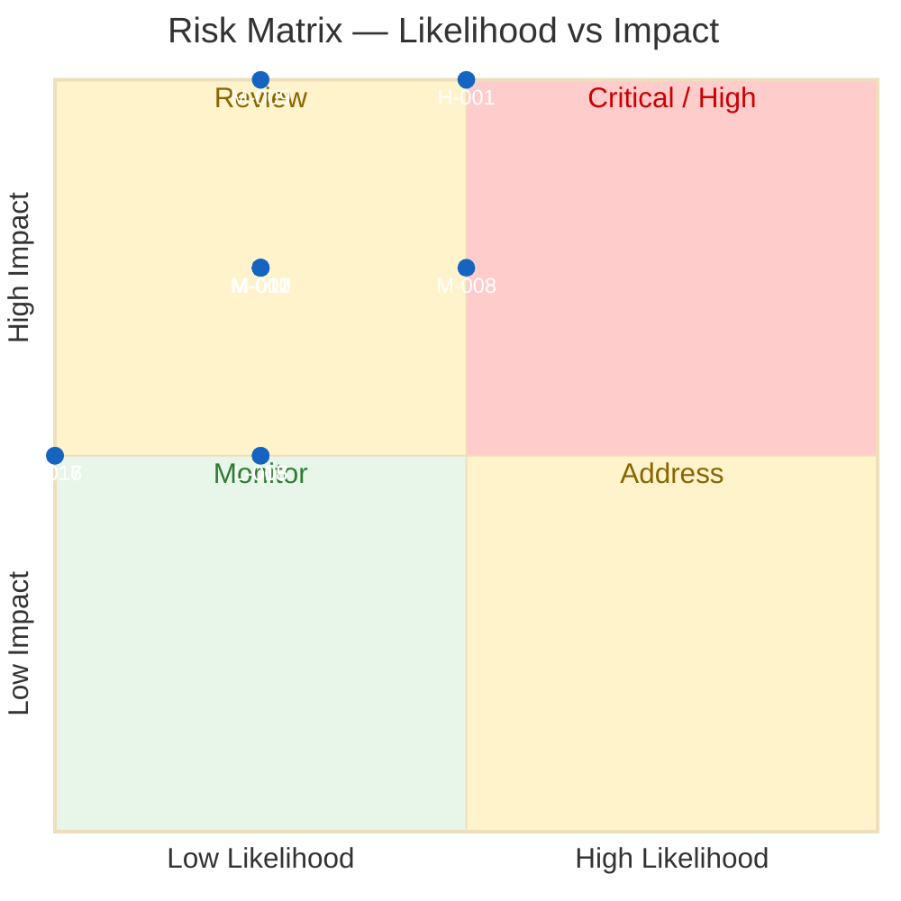

## Data Flow Diagram

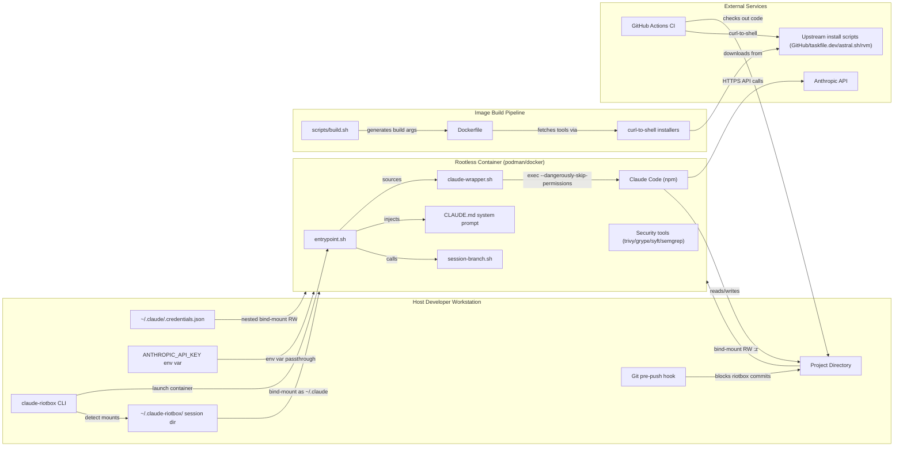

## Findings

---

### 🟠 RIOTBOX-20260312-001: Supply chain compromise via unpinned curl-to-shell installers in Dockerfile and setup scripts

**Severity:** High &nbsp;|&nbsp; **Risk Score:** 15 (L3 × I5) &nbsp;|&nbsp;
**Status:** Open

#### System Context

- **Service:** Image Build Pipeline
- **Affected components:** Dockerfile, setup.sh, .github/workflows/test.yml
- **Attack surface:** Supply Chain

#### Evidence

- **Source:** manual
- **Rule / Check ID:** N/A
- **CVE ID:** N/A
- **Locations:**
  - `/workspace/Dockerfile:24` — `curl -sfL
    https://raw.githubusercontent.com/aquasecurity/trivy/main/contrib/install.sh
    | sh -s -- -b /tools/bin`
  - `/workspace/Dockerfile:29` — `curl -sSfL
    https://raw.githubusercontent.com/anchore/grype/main/install.sh | sh -s --
    -b /tools/bin`
  - `/workspace/Dockerfile:34` — `curl -sSfL
    https://raw.githubusercontent.com/anchore/syft/main/install.sh | sh -s -- -b
    /tools/bin`
  - `/workspace/Dockerfile:39` — `curl -sL https://taskfile.dev/install.sh | sh
    -s -- -b /tools/bin`
  - `/workspace/Dockerfile:46` — `curl -LO
    https://github.com/ovh/venom/releases/latest/download/venom.linux-${ARCH}`
  - `/workspace/Dockerfile:188` — `curl -fsSL
    https://raw.githubusercontent.com/nvm-sh/nvm/v${NVM_INSTALLER_VERSION}/install.sh
    | bash`
  - `/workspace/Dockerfile:209` — `curl -LsSf https://astral.sh/uv/install.sh |
    bash`
  - `/workspace/Dockerfile:216` — `curl --proto '=https' --tlsv1.2 -sSf
    https://sh.rustup.rs | sh -s -- -y`
  - `/workspace/Dockerfile:240` — `curl -sSL https://get.rvm.io | bash -s
    stable`
  - `/workspace/setup.sh:113` — `sudo sh -c 'curl -sL
    https://taskfile.dev/install.sh | sh -s -- -b /usr/local/bin'`
  - `/workspace/.github/workflows/test.yml:21` — `curl -sSfL -o
    /usr/local/bin/hadolint
    https://github.com/hadolint/hadolint/releases/latest/download/hadolint-Linux-x86_64`

#### Asset & Security Criteria

- **Business asset:** Integrity of the container image and all projects
  processed by it
- **IS asset:** Container image build artifacts and toolchain binaries
- **Criteria violated:** Integrity, Availability

#### Misuser Profile

- **Actor:** Supply chain attacker (compromised upstream repository or CDN)
- **Motivation:** Inject malicious code into developer environments via poisoned
  install scripts or binaries
- **Capability required:** High -- requires compromising a GitHub repository,
  CDN, or DNS for an upstream project

#### Threat Classification

- **Spoofing**: ✓ — Attacker can spoof a legitimate install script by
  compromising the upstream hosting (GitHub raw content, CDN, or DNS)
- **Tampering**: ✓ — Tampered install scripts execute arbitrary code as the
  build user, modifying the container image contents
- **Repudiation**: ✗ — Build logs capture the download URLs but not the content
  served, so tampering evidence is limited
- **Information Disclosure**: ✓ — A compromised installer could exfiltrate
  build-time environment variables or host-introspected data from build.sh
- **Denial Of Service**: ✓ — A poisoned installer could corrupt the image,
  causing all riotbox sessions to fail
- **Elevation Of Privilege**: ✓ — Malicious code runs as root (in the tools
  stage) or as the claude user, and could embed persistent backdoors in the
  image

#### Preconditions (Vulnerabilities)

- At least one upstream install script hosting endpoint (GitHub raw,
  taskfile.dev, astral.sh, get.rvm.io, sh.rustup.rs) is compromised or MITMed
- The image is rebuilt, pulling the compromised script

#### Attack Path

**Primary:**
1. Attacker compromises an upstream repository or CDN hosting an install script
   (e.g. trivy, grype, syft, taskfile, nvm, uv, rustup, rvm)
2. Developer runs 'task build' or 'claude-riotbox build', triggering Dockerfile
   build
3. Dockerfile fetches the compromised install script via curl and pipes it to sh
4. Malicious code executes during image build, embedding a backdoor in the
   container image
5. All subsequent riotbox sessions run the backdoored image, giving the attacker
   code execution inside the container with access to bind-mounted project files
   and credentials

**Attack chaining:**
- Enabled by: ['RIOTBOX-20260312-005']
- Enables: ['RIOTBOX-20260312-010']

#### Attack Sequence

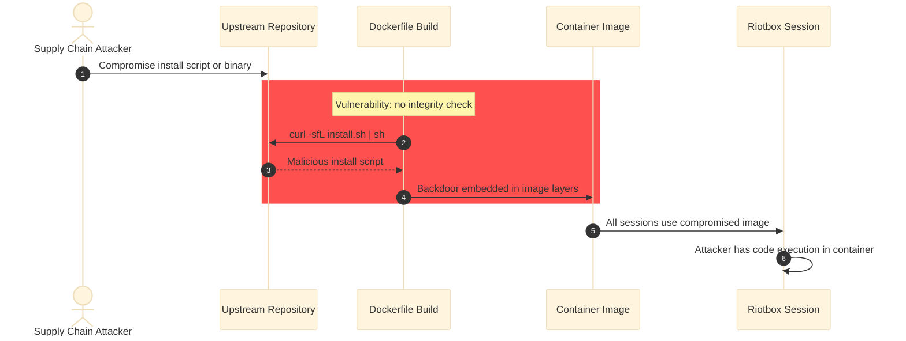

#### Impact

**Likelihood:** Medium — Requires compromising a well-maintained upstream
project (trivy, grype, nvm, rustup, etc.), which is a non-trivial but documented
attack vector. The image is rebuilt infrequently (not on every session start),
limiting the exposure window. However, 9+ separate curl-to-shell invocations in
the Dockerfile multiply the attack surface. The TODO(security) comments in the
Dockerfile indicate the maintainer is aware but has not yet implemented
mitigations.

**Technical:** Arbitrary code execution during image build. The tools stage runs
as root; the runtime stage curl-to-shell commands run as the claude user (UID
1000) with passwordless sudo. A backdoor embedded at build time persists across
all container sessions.

**Business:**
- Financial: Compromised developer workstation could lead to IP theft or supply
  chain attack on downstream projects
- Regulatory: N/A -- no regulated data, but compromised developer environments
  are a reportable incident in many organizations
- Operational: All riotbox sessions compromised until image is rebuilt from
  clean sources
- Reputational: Tool positioned as security sandbox would itself be the attack
  vector

**If not remediated:** Every container session runs with a potentially
backdoored image. The attacker gains persistent access to all projects processed
through riotbox, including the ability to modify source code, steal API keys,
and exfiltrate credentials.

#### Mitigations

**Preventive controls:**
- **Pin base image to digest and all install scripts to commit SHA or versioned
  URL with checksum verification** *(effort: M)* → step 3: Replace each curl|sh
  with a two-step download-then-verify pattern: (1) Download to a temp file, (2)
  verify SHA256 against a pinned hash, (3) execute only if hash matches. For the
  base image, use FROM quay.io/centos/centos:stream10@sha256:<digest>. For tools
  with published checksums (trivy, grype, syft), verify them. For venom (no
  published checksums), compute and pin a self-managed SHA256. Example for
  trivy: RUN curl -sfL -o /tmp/install-trivy.sh
  https://raw.githubusercontent.com/aquasecurity/trivy/v0.58.2/contrib/install.sh
  && \
    echo "<expected-sha256>  /tmp/install-trivy.sh" | sha256sum -c && \
    sh /tmp/install-trivy.sh -b /tools/bin
- **Use multi-stage build with COPY --from=tools to isolate download stage**
  *(effort: L)* → step 4: Already partially implemented (tools stage exists).
  Ensure no curl|sh commands run in the runtime stage. Move nvm, uv, rustup, and
  rvm installations to a dedicated builder stage or use pre-built binaries with
  checksum verification.

**Detective controls:**
- **Image SBOM generation and vulnerability scan on every build** *(effort: S)*
  → step 4: Add a post-build step that runs syft and grype against the built
  image: syft claude-riotbox:latest -o spdx-json | grype --fail-on high.
  Integrate into the Taskfile build task.
- **Reproducible build verification** *(effort: M)* → step 3: Log SHA256 of
  every downloaded artifact during build (add sha256sum after each curl
  download). Compare against known-good hashes in CI.

#### Compliance Mapping

- OWASP Top 10 A06:2021 - Vulnerable and Outdated Components — 

#### Risk Treatment

- **Decision:** 
- **Rationale:** 
- **Authority:** 
- **Residual risk score:** 
- **Review date:** 

#### Ticket

**Pin all curl-to-shell installers to versioned URLs with SHA256 verification**

The Dockerfile and setup scripts use 9+ curl-to-shell patterns that download and
execute install scripts from upstream sources without integrity verification.
This creates a supply chain attack surface where a compromised upstream could
inject malicious code into the container image.

**Steps to reproduce:**
1. Inspect Dockerfile lines 24-49 and 188-249 for curl|sh patterns
1. Inspect setup.sh line 113 for curl|sh with sudo
1. Inspect .github/workflows/test.yml lines 21 and 26-27 for curl downloads
   without checksum verification
1. For each, verify no SHA256 or GPG signature check exists between download and
   execution

**Acceptance criteria:**
- [ ] Every curl download in Dockerfile verifies a SHA256 checksum before
  execution
- [ ] Base image FROM line includes @sha256: digest pin
- [ ] setup.sh curl-to-shell includes checksum verification
- [ ] CI workflow downloads include checksum verification
- [ ] A CHECKSUMS file or equivalent is maintained in the repository for all
  pinned versions

**Labels:** 
**Assignee team:** 

---

### 🟡 RIOTBOX-20260312-007: Shell, resume, and audit entry points bypass pre-session backup mechanism

**Severity:** Medium &nbsp;|&nbsp; **Risk Score:** 8 (L2 × I4) &nbsp;|&nbsp;
**Status:** Open

#### System Context

- **Service:** Session Management
- **Affected components:** .taskfiles/session.yml, .taskfiles/scripts/launch.sh,
  .taskfiles/scripts/run.sh
- **Attack surface:** Application

#### Evidence

- **Source:** manual
- **Rule / Check ID:** N/A
- **CVE ID:** N/A
- **Locations:**
  - `/workspace/.taskfiles/session.yml:86` — `cmd:
    "{{.ROOT_DIR}}/.taskfiles/scripts/launch.sh bash"`
  - `/workspace/.taskfiles/session.yml:44` — `cmd:
    "{{.ROOT_DIR}}/.taskfiles/scripts/launch.sh claude --continue"`
  - `/workspace/.taskfiles/scripts/run.sh:46` — `for dir in
    "${PROJECT_DIRS[@]}"; do`

#### Asset & Security Criteria

- **Business asset:** Recoverability of developer project source code
- **IS asset:** Git repository state and project file integrity
- **Criteria violated:** Availability, Integrity

#### Misuser Profile

- **Actor:** Compromised or malfunctioning LLM inside the container
- **Motivation:** Accidental or malicious destruction of project files and git
  history
- **Capability required:** Low -- the LLM has full shell access with write
  privileges

#### Threat Classification

- **Spoofing**: ✗ — No identity component
- **Tampering**: ✓ — Project files can be modified or deleted without a
  pre-session checkpoint to restore from
- **Repudiation**: ✓ — Without a checkpoint tag, the exact pre-session state
  cannot be determined
- **Information Disclosure**: ✗ — Backup gap does not expose information
- **Denial Of Service**: ✓ — Loss of project files or git history without backup
  means no recovery
- **Elevation Of Privilege**: ✗ — Backup mechanism does not affect privileges

#### Preconditions (Vulnerabilities)

- Developer uses 'task shell', 'task resume', or 'task audit' instead of 'task
  run'
- The LLM or manual session performs destructive operations on the project

#### Attack Path

**Primary:**
1. Developer runs 'task shell' to open an interactive riotbox session (or 'task
   resume' to continue a previous session)
2. session.yml invokes launch.sh directly, bypassing run.sh's backup logic
3. No checkpoint commit, tag, or bare-clone backup is created
4. LLM or user performs destructive git operations (force-push, reset --hard,
   branch deletion) or deletes project files
5. No backup exists to restore from; data loss is permanent

**Attack chaining:**
- Enabled by: ['None']
- Enables: ['None']

#### Attack Sequence

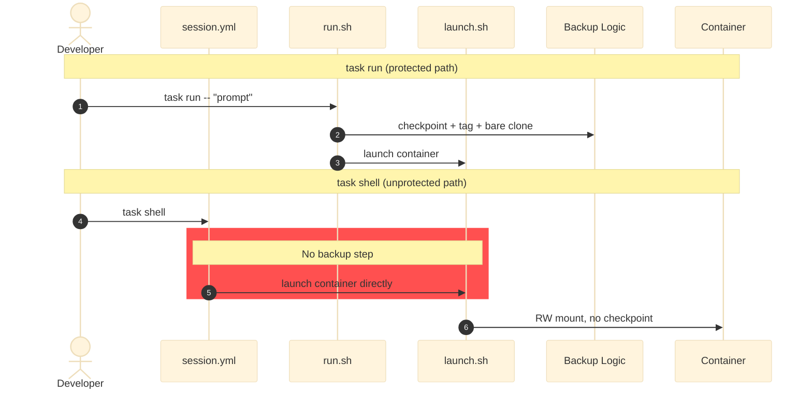

#### Impact

**Likelihood:** Medium — Requires user to use shell (interactive) and decline
the session branch prompt. The user is present during shell sessions and can
manage recovery manually. However, the lack of automatic backup is not
explicitly documented in the README.

**Technical:** run.sh creates a checkpoint commit, tags it, and pushes to a
local bare backup repo (~/.claude-riotbox/backups/) before launching the
container. shell, resume, and audit call launch.sh directly without this step.
Note: audit.sh sets RIOTBOX_READONLY=1, so the project mount is read-only and
destruction is not possible via audit.

**Business:**
- Financial: Loss of uncommitted work or project history could require
  significant rework
- Regulatory: N/A
- Operational: Unrecoverable project damage from interactive sessions
- Reputational: Tool claims backup safety but provides it inconsistently

**If not remediated:** Interactive shell and resume sessions operate without
backup protection. A destructive LLM session via 'task shell' has no safety net.

#### Mitigations

**Preventive controls:**
- **Extract backup logic into a shared function and call it from all entry
  points** *(effort: S)* → step 3: Move the checkpoint/backup logic from run.sh
  (lines 46-75) into a shared script (e.g. scripts/checkpoint.sh). Source it
  from run.sh, and add calls in session.yml for shell and resume tasks (before
  launch.sh is invoked). Skip backup for audit since it mounts read-only.

**Detective controls:**
- **Warn when launching without backup** *(effort: S)* → step 2: Add a check in
  launch.sh that prints a warning if no checkpoint tag exists for the current
  session: 'echo "WARNING: No pre-session backup created. Run task run for
  backup protection." >&2'

#### Compliance Mapping

- OWASP Top 10 A05:2021 - Security Misconfiguration — 

#### Risk Treatment

- **Decision:** 
- **Rationale:** 
- **Authority:** 
- **Residual risk score:** 
- **Review date:** 

#### Ticket

**Apply pre-session backup to all entry points (shell, resume)**

Only the 'run' entry point creates a pre-session backup checkpoint. Shell and
resume sessions mount projects read-write without creating a backup, leaving no
recovery path for destructive LLM sessions.

**Steps to reproduce:**
1. Run 'task shell' on a project directory
1. Inside the container, run: git reset --hard HEAD~5
1. Exit the container
1. Check ~/.claude-riotbox/backups/ -- no backup exists for this session

**Acceptance criteria:**
- [ ] All RW entry points (shell, resume) create a checkpoint before launching
- [ ] Audit entry point is exempt (read-only mount)
- [ ] Backup logic is shared, not duplicated

**Labels:** 
**Assignee team:** 

---

### 🟡 RIOTBOX-20260312-008: Host .npmrc auth tokens baked into container image via build.sh config copy

**Severity:** Medium &nbsp;|&nbsp; **Risk Score:** 12 (L3 × I4) &nbsp;|&nbsp;
**Status:** Open

#### System Context

- **Service:** Image Build Pipeline
- **Affected components:** scripts/build.sh, Dockerfile, .dockerignore
- **Attack surface:** Supply Chain

#### Evidence

- **Source:** manual
- **Rule / Check ID:** N/A
- **CVE ID:** N/A
- **Locations:**
  - `/workspace/scripts/build.sh:147` — `copy_if_exists "${HOME}/.npmrc"
    ".npmrc"`
  - `/workspace/Dockerfile:356` — `COPY --chown=claude:claude configs/
    /home/claude/`
  - `/workspace/.dockerignore:1` — `# Never bake secrets or host identity into
    the image`

#### Asset & Security Criteria

- **Business asset:** Private npm registry authentication tokens
- **IS asset:** npm _authToken credentials in .npmrc
- **Criteria violated:** Confidentiality

#### Misuser Profile

- **Actor:** Anyone with access to the built container image
- **Motivation:** Extract npm auth tokens to access private registries or
  publish malicious packages
- **Capability required:** Low -- tokens visible by inspecting image layers or
  running the container

#### Threat Classification

- **Spoofing**: ✓ — Stolen auth tokens allow impersonating the developer on npm
  registries
- **Tampering**: ✓ — Write access to private registries could allow publishing
  tampered packages
- **Repudiation**: ✓ — Actions taken with the stolen token appear to come from
  the legitimate developer
- **Information Disclosure**: ✓ — Auth tokens are baked into a permanent image
  layer, extractable by anyone with image access
- **Denial Of Service**: ✗ — Not the primary concern
- **Elevation Of Privilege**: ✗ — Registry tokens do not grant host or container
  privilege escalation

#### Preconditions (Vulnerabilities)

- Developer's ~/.npmrc contains _authToken for a private registry
- Developer runs 'task build' (build.sh copies .npmrc into configs/)
- The built image is shared or stored where others can access it

#### Attack Path

**Primary:**
1. Developer runs 'task build'; build.sh copies ~/.npmrc (containing _authToken)
   to configs/.npmrc
2. Dockerfile COPY configs/ /home/claude/ bakes .npmrc with auth token into a
   permanent image layer
3. The image is pushed to a registry, shared, or left accessible on the host
4. Attacker extracts the token via 'podman history' layer inspection or 'cat
   /home/claude/.npmrc' inside a container

**Attack chaining:**
- Enabled by: ['None']
- Enables: ['None']

#### Attack Sequence

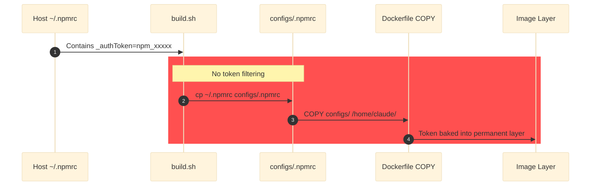

#### Impact

**Likelihood:** Medium — Many enterprise developers have .npmrc files with
_authToken for private registries (GitHub Packages, npm Enterprise,
Artifactory). The .dockerignore excludes .env, credentials, secrets, and
.gitconfig but does NOT exclude .npmrc. The build.sh comment says "never
secrets" but the .npmrc copy is not filtered for auth tokens.

**Technical:** npm _authToken values are plaintext credentials. Once baked into
an image layer, they persist even if the file is deleted in a later layer. The
token grants authenticated access to the private registry.

**Business:**
- Financial: Compromised private registry access could enable supply chain
  attacks on internal packages
- Regulatory: Credential exposure may be a reportable security incident
- Operational: Token must be rotated after exposure is detected
- Reputational: N/A

**If not remediated:** Every image built by a developer with a private .npmrc
bakes auth tokens into a permanent image layer.

#### Mitigations

**Preventive controls:**
- **Strip auth tokens from .npmrc before copying into build context** *(effort:
  S)* → step 1: In build.sh, filter .npmrc before copying: grep -v '_authToken'
  ~/.npmrc > configs/.npmrc. Or only copy registry URL lines. Alternatively, add
  configs/.npmrc to .dockerignore and mount .npmrc at runtime instead.
- **Add .npmrc to .dockerignore** *(effort: S)* → step 2: Add 'configs/.npmrc'
  to .dockerignore. This prevents the token from being baked into the image.
  Mount the .npmrc at runtime via a read-only bind mount if registry access is
  needed in the container.

**Detective controls:**
- **Scan built images for embedded credentials** *(effort: S)* → step 2: Run
  'trivy config' or a custom check against the built image to detect _authToken
  patterns in image layers.

#### Compliance Mapping

- OWASP Top 10 A07:2021 - Identification and Authentication Failures — 

#### Risk Treatment

- **Decision:** 
- **Rationale:** 
- **Authority:** 
- **Residual risk score:** 
- **Review date:** 

#### Ticket

**Prevent .npmrc auth tokens from being baked into container image**

build.sh copies the host .npmrc into configs/ without stripping auth tokens. The
Dockerfile then COPYs it into the image. Add .npmrc to .dockerignore or strip
_authToken lines before copying.

**Steps to reproduce:**
1. Ensure ~/.npmrc contains an _authToken line
1. Run 'task build'
1. Inspect configs/.npmrc -- verify it contains the _authToken
1. Run the container: cat /home/claude/.npmrc -- token is present

**Acceptance criteria:**
- [ ] .npmrc auth tokens are never baked into the image
- [ ] Either .npmrc is excluded from build context or tokens are stripped
- [ ] Registry access (if needed) uses runtime mount instead

**Labels:** 
**Assignee team:** 

---

### 🟡 RIOTBOX-20260312-009: Unpinned npm global installs with postinstall hook execution in Dockerfile

**Severity:** Medium &nbsp;|&nbsp; **Risk Score:** 10 (L2 × I5) &nbsp;|&nbsp;
**Status:** Open

#### System Context

- **Service:** Image Build Pipeline
- **Affected components:** Dockerfile
- **Attack surface:** Supply Chain

#### Evidence

- **Source:** manual
- **Rule / Check ID:** N/A
- **CVE ID:** N/A
- **Locations:**
  - `/workspace/Dockerfile:362` — `RUN npm install -g @mermaid-js/mermaid-cli &&
    mmdc --version`
  - `/workspace/Dockerfile:381` — `RUN npm install -g @anthropic-ai/claude-code
    && claude --version`

#### Asset & Security Criteria

- **Business asset:** Integrity of the container image
- **IS asset:** npm packages and their transitive dependency tree
- **Criteria violated:** Integrity

#### Misuser Profile

- **Actor:** Supply chain attacker compromising an npm package or its dependency
- **Motivation:** Execute arbitrary code during image build via npm postinstall
  hooks
- **Capability required:** Medium -- requires compromising an npm package
  (direct or transitive)

#### Threat Classification

- **Spoofing**: ✓ — A typosquatted or compromised package impersonates the
  legitimate one
- **Tampering**: ✓ — Postinstall hooks execute arbitrary code, modifying the
  image
- **Repudiation**: ✗ — npm audit logs record installed packages
- **Information Disclosure**: ✓ — Postinstall hooks can exfiltrate environment
  variables and build context
- **Denial Of Service**: ✓ — Corrupted packages can break the image build
- **Elevation Of Privilege**: ✓ — Postinstall code runs as the claude user with
  passwordless sudo

#### Preconditions (Vulnerabilities)

- An npm package in the dependency tree of claude-code or mermaid-cli is
  compromised
- The image is rebuilt, pulling the compromised version

#### Attack Path

**Primary:**
1. Attacker publishes a compromised version of a transitive dependency (or the
   direct package itself)
2. Developer runs 'task build', triggering npm install -g without version
   pinning
3. npm resolves to the latest (compromised) version and executes postinstall
   hooks
4. Malicious postinstall script executes arbitrary code during build, embedding
   backdoor in the image

**Attack chaining:**
- Enabled by: ['None']
- Enables: ['None']

#### Attack Sequence

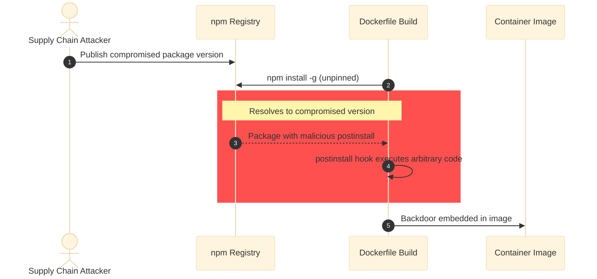

#### Impact

**Likelihood:** Low — @anthropic-ai/claude-code is a first-party Anthropic
package with presumably strong supply chain controls. @mermaid-js/mermaid-cli is
a popular, well-maintained package. However, their transitive dependency trees
are large (hundreds of packages), and npm ecosystem compromises are
well-documented (ua-parser-js, event-stream, etc.). Unpinned installs mean any
new compromised version is pulled automatically.

**Technical:** npm postinstall hooks run arbitrary shell commands during 'npm
install'. Without version pins or --ignore-scripts, every transitive
dependency's postinstall hook executes. The claude user has passwordless sudo,
so postinstall code can modify the entire filesystem.

**Business:**
- Financial: Backdoored image compromises all developer sessions
- Regulatory: N/A
- Operational: Image must be rebuilt from scratch after detection
- Reputational: Supply chain compromise via a security tool

**If not remediated:** Every image rebuild pulls the latest versions of npm
packages and executes their postinstall hooks without integrity verification.

#### Mitigations

**Preventive controls:**
- **Pin npm packages to exact versions** *(effort: S)* → step 2: Pin to exact
  versions: 'npm install -g @anthropic-ai/claude-code@X.Y.Z' and 'npm install -g
  @mermaid-js/mermaid-cli@X.Y.Z'. Use --ignore-scripts during install and
  explicitly run only known-safe postinstall steps.
- **Use npm lockfile or shrinkwrap for reproducible installs** *(effort: M)* →
  step 3: Generate a package-lock.json for global installs and use 'npm ci
  --global' to install from the lockfile with exact versions.

**Detective controls:**
- **Audit npm packages after install** *(effort: S)* → step 3: Add 'npm audit
  --audit-level=high' after each global install in the Dockerfile. Fail the
  build if high-severity vulnerabilities are detected.

#### Compliance Mapping

- OWASP Top 10 A06:2021 - Vulnerable and Outdated Components — 

#### Risk Treatment

- **Decision:** 
- **Rationale:** 
- **Authority:** 
- **Residual risk score:** 
- **Review date:** 

#### Ticket

**Pin npm global installs to exact versions in Dockerfile**

Dockerfile installs @anthropic-ai/claude-code and @mermaid-js/mermaid-cli
without version pinning. npm postinstall hooks from transitive dependencies
execute arbitrary code during build. Pin to exact versions.

**Steps to reproduce:**
1. Inspect Dockerfile lines 362 and 381
1. Note no version specifiers on npm install -g commands
1. Run: npm info @mermaid-js/mermaid-cli | grep postinstall

**Acceptance criteria:**
- [ ] Both npm install -g commands specify exact versions
- [ ] A Renovate/Dependabot config tracks npm version updates

**Labels:** 
**Assignee team:** 

---

### 🟡 RIOTBOX-20260312-010: Unpinned pip, cargo, and go installs in Dockerfile without integrity verification

**Severity:** Medium &nbsp;|&nbsp; **Risk Score:** 8 (L2 × I4) &nbsp;|&nbsp;
**Status:** Open

#### System Context

- **Service:** Image Build Pipeline
- **Affected components:** Dockerfile
- **Attack surface:** Supply Chain

#### Evidence

- **Source:** manual
- **Rule / Check ID:** N/A
- **CVE ID:** N/A
- **Locations:**
  - `/workspace/Dockerfile:152` — `RUN pip3 install --no-cache-dir
    --break-system-packages semgrep pyyaml && semgrep --version`
  - `/workspace/Dockerfile:230` — `cargo binstall --no-confirm ast-grep && sg
    --version`
  - `/workspace/Dockerfile:254` — `go install golang.org/x/tools/gopls@latest`

#### Asset & Security Criteria

- **Business asset:** Integrity of installed tools in the container image
- **IS asset:** Python, Rust, and Go packages installed during build
- **Criteria violated:** Integrity

#### Misuser Profile

- **Actor:** Supply chain attacker compromising PyPI, crates.io, or Go module
  proxy
- **Motivation:** Inject malicious code into developer environments via poisoned
  packages
- **Capability required:** Medium -- requires compromising a package registry or
  typosquatting

#### Threat Classification

- **Spoofing**: ✓ — Typosquatting or registry compromise can substitute a
  malicious package
- **Tampering**: ✓ — Unpinned versions allow pulling a tampered release
- **Repudiation**: ✗ — Build logs record the installed versions
- **Information Disclosure**: ✓ — Malicious setup.py or build.rs can exfiltrate
  build environment data
- **Denial Of Service**: ✓ — Corrupted packages break the image build
- **Elevation Of Privilege**: ✓ — pip install runs setup.py which executes
  arbitrary code; the claude user has passwordless sudo

#### Preconditions (Vulnerabilities)

- A package on PyPI, crates.io, or Go module proxy is compromised
- The image is rebuilt, pulling the compromised version

#### Attack Path

**Primary:**
1. Attacker compromises semgrep, pyyaml, ast-grep, or gopls on their respective
   registries
2. Developer rebuilds the image; unpinned installs pull the latest (compromised)
   version
3. Malicious code executes during install (setup.py for pip, build script for
   cargo, go generate for go)
4. Backdoor embedded in the container image

**Attack chaining:**
- Enabled by: ['RIOTBOX-20260312-001']
- Enables: ['None']

#### Attack Sequence

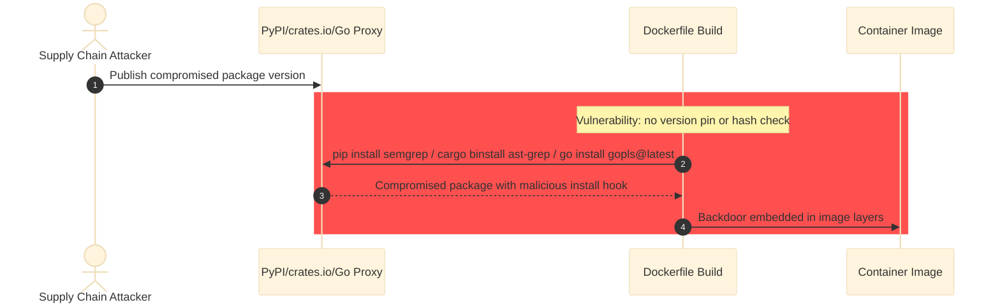

#### Impact

**Likelihood:** Low — semgrep, pyyaml, ast-grep, and gopls are well-maintained
packages with strong ownership. However, their dependency trees include many
transitive packages. pip install executes setup.py which can run arbitrary code.
The @latest tag for gopls means any new version is automatically pulled.

**Technical:** pip install runs setup.py hooks. cargo binstall downloads
pre-built binaries without hash verification (ast-grep). go install fetches and
compiles from source via the Go module proxy. All run as the claude user with
sudo access.

**Business:**
- Financial: Compromised tools in the image affect all subsequent sessions
- Regulatory: N/A
- Operational: Image rebuild required after detection
- Reputational: N/A

**If not remediated:** Every image rebuild pulls unpinned versions of pip,
cargo, and Go packages without integrity verification.

#### Mitigations

**Preventive controls:**
- **Pin all packages to exact versions with hash verification** *(effort: S)* →
  step 2: Pin pip packages: 'pip3 install semgrep==X.Y.Z pyyaml==X.Y.Z'. Use
  pip's --require-hashes with a requirements file for integrity. Pin ast-grep:
  'cargo binstall ast-grep@X.Y.Z'. Pin gopls: 'go install
  golang.org/x/tools/gopls@vX.Y.Z'.

**Detective controls:**
- **Log installed versions and compare against known-good** *(effort: S)* → step
  3: After each install, log the exact version and hash. Compare against a
  known-good manifest maintained in the repository.

#### Compliance Mapping

- OWASP Top 10 A06:2021 - Vulnerable and Outdated Components — 

#### Risk Treatment

- **Decision:** 
- **Rationale:** 
- **Authority:** 
- **Residual risk score:** 
- **Review date:** 

#### Ticket

**Pin pip, cargo, and go installs to exact versions in Dockerfile**

The Dockerfile installs semgrep, pyyaml, ast-grep, and gopls without version
pins or hash verification. Pin all to exact versions.

**Steps to reproduce:**
1. Inspect Dockerfile lines 152, 230, and 254
1. Note no version specifiers on pip, cargo binstall, or go install commands

**Acceptance criteria:**
- [ ] All pip, cargo, and go installs specify exact versions
- [ ] pip installs use --require-hashes where possible

**Labels:** 
**Assignee team:** 

---

### 🟡 RIOTBOX-20260312-011: Claude Code plugins fetched at build time without integrity verification

**Severity:** Medium &nbsp;|&nbsp; **Risk Score:** 8 (L2 × I4) &nbsp;|&nbsp;
**Status:** Open

#### System Context

- **Service:** Image Build Pipeline
- **Affected components:** Dockerfile
- **Attack surface:** Supply Chain

#### Evidence

- **Source:** manual
- **Rule / Check ID:** N/A
- **CVE ID:** N/A
- **Locations:**
  - `/workspace/Dockerfile:389` — `CLAUDE_CONFIG_DIR="${STAGING_DIR}" claude
    plugin marketplace add anthropics/claude-plugins-official`
  - `/workspace/Dockerfile:391` — `CLAUDE_CONFIG_DIR="${STAGING_DIR}" claude
    plugin install "$p" || true`

#### Asset & Security Criteria

- **Business asset:** Integrity of Claude Code plugin ecosystem within the image
- **IS asset:** Claude Code plugins and their code
- **Criteria violated:** Integrity

#### Misuser Profile

- **Actor:** Supply chain attacker compromising a Claude Code plugin repository
- **Motivation:** Achieve persistent code execution in all riotbox sessions via
  a backdoored plugin
- **Capability required:** Medium -- requires compromising the
  anthropics/claude-plugins-official GitHub repository or a plugin source

#### Threat Classification

- **Spoofing**: ✓ — A compromised plugin repository can serve malicious plugin
  code
- **Tampering**: ✓ — Plugins execute code within the Claude Code process;
  tampering enables arbitrary actions
- **Repudiation**: ✗ — Plugin installation is logged in the Dockerfile build
  output
- **Information Disclosure**: ✓ — A malicious plugin has access to all data
  Claude Code processes
- **Denial Of Service**: ✓ — A broken plugin can crash Claude Code
- **Elevation Of Privilege**: ✓ — Plugins run with the same permissions as
  Claude Code (full shell access)

#### Preconditions (Vulnerabilities)

- The anthropics/claude-plugins-official repo or a plugin source is compromised
- The image is rebuilt, fetching the compromised plugin

#### Attack Path

**Primary:**
1. Attacker compromises the plugin repository or a plugin's source code
2. Developer rebuilds the image; claude plugin install fetches the compromised
   plugin without verification
3. Plugin code is pre-staged in the image at ~/.riotbox/plugins-staging/
4. Every subsequent session copies the backdoored plugin into the active session
   directory

**Attack chaining:**
- Enabled by: ['None']
- Enables: ['None']

#### Attack Sequence

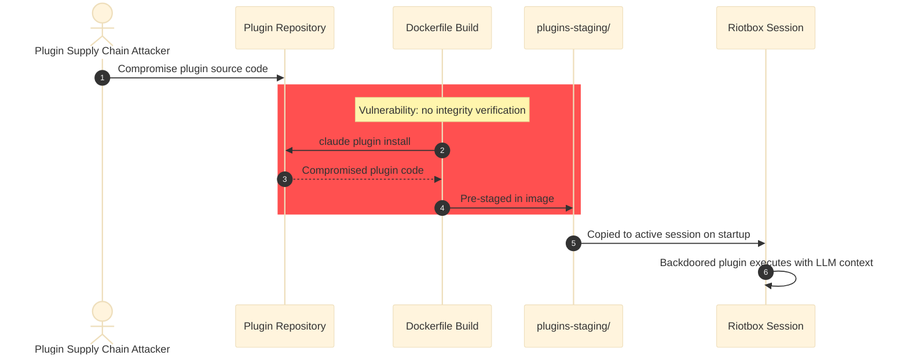

#### Impact

**Likelihood:** Low — The anthropics/claude-plugins-official repository is
maintained by Anthropic with presumably strong access controls. However, the
plugins are cloned from GitHub without signature verification or commit pinning.
The '|| true' on each plugin install means failures are silently ignored,
reducing detection of partial compromises.

**Technical:** 12+ plugins are installed at build time. Each plugin's code
executes within the Claude Code Node.js process. There is no signature
verification, hash pinning, or integrity check. The plugins persist across all
sessions via the staging directory.

**Business:**
- Financial: All sessions compromised via persistent plugin backdoor
- Regulatory: N/A
- Operational: Image rebuild and plugin audit required
- Reputational: Plugin ecosystem compromise affects all users

**If not remediated:** Every image includes pre-staged plugins fetched without
integrity verification. A compromised plugin persists across all sessions.

#### Mitigations

**Preventive controls:**
- **Pin plugin installations to specific commit SHAs or versions** *(effort: M)*
  → step 2: Pin the marketplace add to a specific commit: clone at a specific
  SHA rather than HEAD. For each plugin install, verify the installed code
  against a known-good hash maintained in the repository.

**Detective controls:**
- **Verify plugin integrity at container startup** *(effort: M)* → step 4: In
  entrypoint.sh, compute SHA256 of installed plugin files and compare against a
  manifest baked into the image.

#### Compliance Mapping

- OWASP Top 10 A08:2021 - Software and Data Integrity Failures — 

#### Risk Treatment

- **Decision:** 
- **Rationale:** 
- **Authority:** 
- **Residual risk score:** 
- **Review date:** 

#### Ticket

**Pin Claude Code plugin installations to specific versions with integrity
checks**

12+ Claude Code plugins are installed at build time without version pinning or
integrity verification. Pin to specific commits and verify checksums.

**Steps to reproduce:**
1. Inspect Dockerfile lines 387-396
1. Note no commit SHA or version pinning on plugin installations
1. Note '|| true' silently ignores installation failures

**Acceptance criteria:**
- [ ] Plugin marketplace add uses a pinned commit SHA
- [ ] Each plugin install verifies integrity
- [ ] Installation failures are not silently suppressed

**Labels:** 
**Assignee team:** 

---

### 🟡 RIOTBOX-20260312-012: Host package manager configs baked into image may redirect dependency resolution

**Severity:** Medium &nbsp;|&nbsp; **Risk Score:** 8 (L2 × I4) &nbsp;|&nbsp;
**Status:** Open

#### System Context

- **Service:** Image Build Pipeline
- **Affected components:** scripts/build.sh, Dockerfile
- **Attack surface:** Supply Chain

#### Evidence

- **Source:** manual
- **Rule / Check ID:** N/A
- **CVE ID:** N/A
- **Locations:**
  - `/workspace/scripts/build.sh:156` — `copy_if_exists
    "${HOME}/.cargo/config.toml" ".cargo/config.toml"`
  - `/workspace/scripts/build.sh:148` — `copy_if_exists "${HOME}/.pip/pip.conf"
    ".pip/pip.conf"`
  - `/workspace/scripts/build.sh:149` — `copy_if_exists
    "${HOME}/.config/pip/pip.conf" ".config/pip/pip.conf"`

#### Asset & Security Criteria

- **Business asset:** Integrity of package resolution within the container
- **IS asset:** Package manager configuration controlling dependency sources
- **Criteria violated:** Integrity

#### Misuser Profile

- **Actor:** Attacker who has compromised host config files or internal registry
- **Motivation:** Redirect dependency resolution to attacker-controlled packages
  via dependency confusion
- **Capability required:** Medium -- requires compromising host config files or
  an internal registry

#### Threat Classification

- **Spoofing**: ✓ — Custom registry URLs could point to attacker-controlled
  mirrors
- **Tampering**: ✓ — Redirected dependency resolution serves modified packages
- **Repudiation**: ✗ — Config files are visible in the build context
- **Information Disclosure**: ✓ — Registry URLs and credentials in config files
  are baked into the image
- **Denial Of Service**: ✗ — Not the primary concern
- **Elevation Of Privilege**: ✗ — Does not directly escalate privileges

#### Preconditions (Vulnerabilities)

- Developer's host has custom pip.conf or cargo/config.toml with internal
  registry URLs
- The internal registry is compromised, or an attacker sets up a dependency
  confusion attack

#### Attack Path

**Primary:**
1. Developer's pip.conf or cargo config.toml contains custom registry URLs
   (internal Artifactory, etc.)
2. build.sh copies these configs into the image
3. Container installs packages using the custom registry configuration
4. Attacker exploits dependency confusion: publishes malicious packages on the
   custom registry (or its mirror chain)

**Attack chaining:**
- Enabled by: ['None']
- Enables: ['None']

#### Attack Sequence

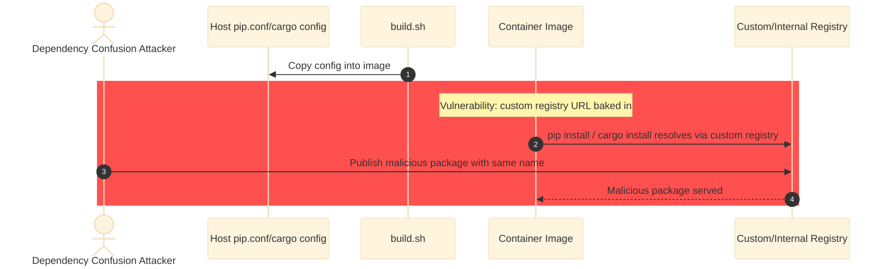

#### Impact

**Likelihood:** Low — Requires both custom registry configs on the host AND a
dependency confusion attack against that registry. Most developers use default
registries. The config copy is a convenience feature for enterprise environments
where private registries are standard. The risk is the same as using these
configs on the host itself.

**Technical:** pip.conf can specify index-url and extra-index-url pointing to
custom registries. cargo/config.toml can specify [registries] and [source]
sections. These are copied verbatim into the image, including any credentials or
custom URLs.

**Business:**
- Financial: Dependency confusion attack could inject malicious code
- Regulatory: N/A
- Operational: Package resolution depends on availability of custom registries
- Reputational: N/A

**If not remediated:** Host package manager configs are baked into the image,
potentially including custom registry URLs and credentials.

#### Mitigations

**Preventive controls:**
- **Strip credentials from copied config files** *(effort: S)* → step 2: In
  build.sh, strip credential-related fields from pip.conf and cargo/config.toml
  before copying. For pip.conf, remove lines containing 'password' or 'cert'.
  For cargo/config.toml, remove [registries.*.token] fields.
- **Document the config copy behaviour and allow opt-out** *(effort: S)* → step
  1: Add documentation explaining which configs are copied and why. Add a
  RIOTBOX_SKIP_HOST_CONFIGS=1 flag to skip the copy.

**Detective controls:**
- **Log which configs were copied during build** *(effort: S)* → step 2: Already
  implemented -- build.sh prints each copied config file.

#### Compliance Mapping

- OWASP Top 10 A08:2021 - Software and Data Integrity Failures — 

#### Risk Treatment

- **Decision:** 
- **Rationale:** 
- **Authority:** 
- **Residual risk score:** 
- **Review date:** 

#### Ticket

**Strip credentials from host config files before baking into image**

build.sh copies pip.conf and cargo/config.toml from the host into the image.
These may contain registry credentials or custom URLs. Strip credentials and
document the behaviour.

**Steps to reproduce:**
1. Create a ~/.cargo/config.toml with a [registries] section containing a token
1. Run 'task build'
1. Inspect configs/.cargo/config.toml -- verify the token is present

**Acceptance criteria:**
- [ ] Credentials are stripped from config files before copying
- [ ] Documentation explains which configs are copied
- [ ] RIOTBOX_SKIP_HOST_CONFIGS=1 opt-out is available

**Labels:** 
**Assignee team:** 

---

### 🟢 RIOTBOX-20260312-005: GitHub Actions workflow uses mutable tag references for actions and tools

**Severity:** Low &nbsp;|&nbsp; **Risk Score:** 6 (L2 × I3) &nbsp;|&nbsp;
**Status:** Open

#### System Context

- **Service:** CI/CD Pipeline
- **Affected components:** .github/workflows/test.yml
- **Attack surface:** Supply Chain

#### Evidence

- **Source:** manual
- **Rule / Check ID:** N/A
- **CVE ID:** N/A
- **Locations:**
  - `/workspace/.github/workflows/test.yml:13` — `uses: actions/checkout@v4`
  - `/workspace/.github/workflows/test.yml:26` — `sudo sh -c 'curl -sL
    https://taskfile.dev/install.sh | sh -s -- -b /usr/local/bin'`
  - `/workspace/.github/workflows/test.yml:21` — `curl -sSfL -o
    /usr/local/bin/hadolint
    https://github.com/hadolint/hadolint/releases/latest/download/hadolint-Linux-x86_64`

#### Asset & Security Criteria

- **Business asset:** Integrity of CI/CD pipeline and build artifacts
- **IS asset:** GitHub Actions workflow configuration
- **Criteria violated:** Integrity

#### Misuser Profile

- **Actor:** Supply chain attacker compromising upstream GitHub Action or tool
  CDN
- **Motivation:** Gain code execution in CI to steal secrets, tamper with
  builds, or pivot to deployment
- **Capability required:** High -- requires compromising a major GitHub Action
  (actions/checkout) or upstream tool distribution

#### Threat Classification

- **Spoofing**: ✓ — A compromised action tag could point to a different commit
  than expected
- **Tampering**: ✓ — Mutable tags allow the action code to change without the
  workflow file changing
- **Repudiation**: ✗ — GitHub Actions logs capture the resolved commit SHA at
  execution time
- **Information Disclosure**: ✓ — A compromised action could exfiltrate
  repository secrets or source code
- **Denial Of Service**: ✗ — CI disruption is low impact for a developer tool
- **Elevation Of Privilege**: ✗ — CI runs with repository-scoped permissions,
  not elevated access

#### Preconditions (Vulnerabilities)

- An upstream action (actions/checkout) is compromised, or its tag is moved to a
  malicious commit
- The CI workflow runs (on push to main or PR to main)

#### Attack Path

**Primary:**
1. Attacker compromises actions/checkout repository or moves the v4 tag to a
   malicious commit
2. CI workflow triggers on next push or PR
3. GitHub Actions resolves actions/checkout@v4 to the compromised commit
4. Malicious checkout action executes in the CI environment

**Attack chaining:**
- Enabled by: ['None']
- Enables: ['RIOTBOX-20260312-001', 'RIOTBOX-20260312-016']

#### Attack Sequence

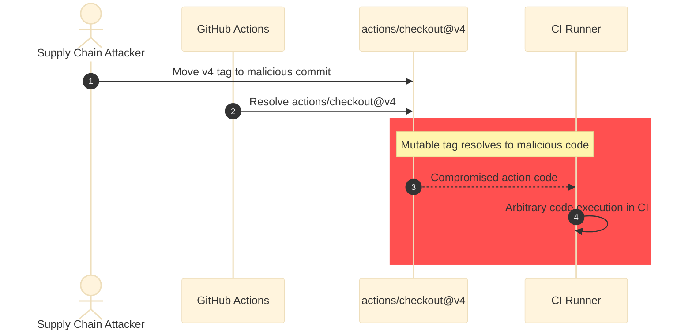

#### Impact

**Likelihood:** Low — actions/checkout is maintained by GitHub and extremely
high-profile, making compromise unlikely. The workflow runs only on push to main
and PRs to main, and has no deployment credentials or publishing steps. The
hadolint and task downloads in CI mirror the Dockerfile pattern but are limited
to CI context.

**Technical:** A compromised action or tool download in CI could execute
arbitrary code in the CI runner, potentially accessing repository secrets or
modifying workflow outputs.

**Business:**
- Financial: N/A -- CI has no deployment or publishing steps
- Regulatory: N/A
- Operational: CI pipeline compromise could block or mislead development
- Reputational: N/A -- low impact for a developer tool CI pipeline

**If not remediated:** CI workflow remains vulnerable to upstream action or tool
compromise. Impact is limited because the workflow has no deployment or
publishing steps.

#### Mitigations

**Preventive controls:**
- **Pin GitHub Actions to full commit SHA** *(effort: S)* → step 3: Replace
  actions/checkout@v4 with actions/checkout@<full-sha>. Determine the current
  SHA: gh api repos/actions/checkout/commits/v4 --jq .sha. Add a comment with
  the tag for readability: uses: actions/checkout@<sha> # v4
- **Pin CI tool downloads to versioned URLs with checksums** *(effort: S)* →
  step 4: For hadolint: download a specific version and verify SHA256. For task:
  pin the install script URL to a versioned release.

**Detective controls:**
- **GitHub Dependabot or Renovate for action version monitoring** *(effort: S)*
  → step 1: Enable Dependabot alerts for GitHub Actions (dependabot.yml with
  package-ecosystem: github-actions) to detect when pinned SHAs have newer
  versions available.

#### Compliance Mapping

- OWASP Top 10 A06:2021 - Vulnerable and Outdated Components — 

#### Risk Treatment

- **Decision:** 
- **Rationale:** 
- **Authority:** 
- **Residual risk score:** 
- **Review date:** 

#### Ticket

**Pin GitHub Actions to commit SHA and CI tool downloads to versioned URLs**

The GitHub Actions workflow uses mutable tag references (actions/checkout@v4)
and unpinned tool downloads (hadolint, task). Pin to commit SHAs and versioned
URLs with checksum verification.

**Steps to reproduce:**
1. Inspect .github/workflows/test.yml
1. Note actions/checkout@v4 uses a mutable tag, not a commit SHA
1. Note hadolint download uses /latest/ URL without checksum
1. Note task install uses curl|sh without version pinning

**Acceptance criteria:**
- [ ] All GitHub Actions use full commit SHA references with version comment
- [ ] All CI tool downloads use versioned URLs with SHA256 verification
- [ ] Dependabot or Renovate is configured for github-actions ecosystem

**Labels:** 
**Assignee team:** 

---

### 🟢 RIOTBOX-20260312-016: GitHub Actions workflow missing explicit permissions key

**Severity:** Low &nbsp;|&nbsp; **Risk Score:** 3 (L1 × I3) &nbsp;|&nbsp;
**Status:** Open

#### System Context

- **Service:** CI/CD Pipeline
- **Affected components:** .github/workflows/test.yml
- **Attack surface:** Application

#### Evidence

- **Source:** manual
- **Rule / Check ID:** N/A
- **CVE ID:** N/A
- **Locations:**
  - `/workspace/.github/workflows/test.yml:1` — `name: Test`

#### Asset & Security Criteria

- **Business asset:** CI/CD pipeline security
- **IS asset:** GITHUB_TOKEN permissions scope
- **Criteria violated:** Integrity

#### Misuser Profile

- **Actor:** Compromised GitHub Action or supply chain attacker
- **Motivation:** Abuse default GITHUB_TOKEN permissions (which may include
  write access) to modify repository
- **Capability required:** High -- requires compromising a GitHub Action used in
  the workflow

#### Threat Classification

- **Spoofing**: ✗ — GITHUB_TOKEN identity is managed by GitHub
- **Tampering**: ✓ — Write permissions on the token could allow modifying
  repository contents
- **Repudiation**: ✗ — GitHub Actions logs are immutable
- **Information Disclosure**: ✓ — Default permissions may include read access to
  org-level secrets
- **Denial Of Service**: ✗ — N/A
- **Elevation Of Privilege**: ✗ — Token permissions are repository-scoped

#### Preconditions (Vulnerabilities)

- A GitHub Action in the workflow is compromised
- The repository does not have restrictive default permissions configured at the
  org level

#### Attack Path

**Primary:**
1. Compromised action (e.g. via tag mutation in RIOTBOX-20260312-005) gains code
   execution in CI
2. Action accesses GITHUB_TOKEN with default permissions
3. Default permissions may include contents: write, packages: write, etc.
4. Attacker modifies repository contents or publishes packages using the token

**Attack chaining:**
- Enabled by: ['RIOTBOX-20260312-005']
- Enables: ['None']

#### Attack Sequence

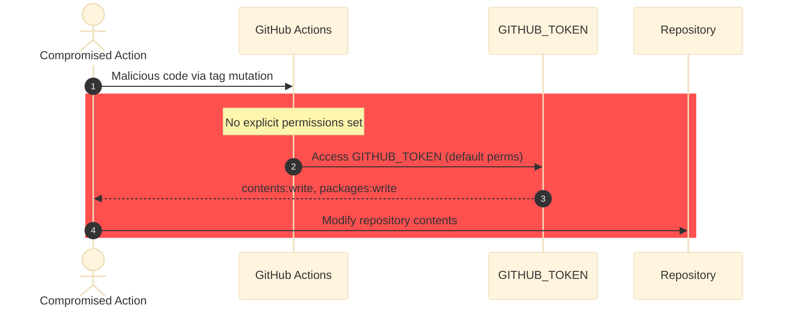

#### Impact

**Likelihood:** Low — Requires a compromised action AND permissive default token
settings. GitHub's recommended default is read-only, but older repositories or
organizations may have write permissions as default. The workflow only uses
actions/checkout, which is high-trust.

**Technical:** Without explicit 'permissions:' in the workflow, GITHUB_TOKEN
inherits the repository or organization default. This may include write access
to contents, packages, and other scopes.

**Business:**
- Financial: N/A -- CI has no deployment steps
- Regulatory: N/A
- Operational: Potential unauthorized repository modification
- Reputational: N/A

**If not remediated:** CI workflow token may have broader permissions than
needed.

#### Mitigations

**Preventive controls:**
- **Add explicit permissions key with least-privilege scopes** *(effort: S)* →
  step 3: Add to test.yml at the top level: permissions:
  contents: read
This restricts the GITHUB_TOKEN to read-only regardless of org defaults.

**Detective controls:**

#### Compliance Mapping

- OWASP Top 10 A01:2021 - Broken Access Control — 

#### Risk Treatment

- **Decision:** 
- **Rationale:** 
- **Authority:** 
- **Residual risk score:** 
- **Review date:** 

#### Ticket

**Add explicit permissions key to GitHub Actions workflow**

The test.yml workflow does not specify a permissions key, inheriting default
GITHUB_TOKEN permissions. Add 'permissions: contents: read' to enforce least
privilege.

**Steps to reproduce:**
1. Inspect .github/workflows/test.yml
1. Note the absence of a 'permissions:' key

**Acceptance criteria:**
- [ ] All workflow files include explicit permissions: contents: read

**Labels:** 
**Assignee team:** 

---

### 🟢 RIOTBOX-20260312-017: Test Dockerfile fetches git-filter-repo from main branch without integrity verification

**Severity:** Low &nbsp;|&nbsp; **Risk Score:** 3 (L1 × I3) &nbsp;|&nbsp;
**Status:** Open

#### System Context

- **Service:** CI/CD Pipeline
- **Affected components:** tests/Dockerfile.test
- **Attack surface:** Supply Chain

#### Evidence

- **Source:** manual
- **Rule / Check ID:** N/A
- **CVE ID:** N/A
- **Locations:**
  - `/workspace/tests/Dockerfile.test:26` — `curl -sSfL
    https://raw.githubusercontent.com/newren/git-filter-repo/main/git-filter-repo
    -o /usr/local/bin/git-filter-repo`
  - `/workspace/tests/Dockerfile.test:18` — `curl -sSfL -o /usr/local/bin/venom
    https://github.com/ovh/venom/releases/latest/download/venom.linux-amd64`

#### Asset & Security Criteria

- **Business asset:** Integrity of the test environment
- **IS asset:** Test Dockerfile and its downloaded binaries
- **Criteria violated:** Integrity

#### Misuser Profile

- **Actor:** Supply chain attacker compromising upstream repositories
- **Motivation:** Inject malicious code into the test environment
- **Capability required:** High -- requires compromising git-filter-repo or
  venom GitHub repositories

#### Threat Classification

- **Spoofing**: ✓ — Compromised main branch serves malicious script
- **Tampering**: ✓ — Fetched script is executed as part of the test image build
- **Repudiation**: ✗ — Build logs record the download
- **Information Disclosure**: ✗ — Test environment has limited sensitive data
- **Denial Of Service**: ✓ — Corrupted download breaks the test image
- **Elevation Of Privilege**: ✗ — Test environment is isolated

#### Preconditions (Vulnerabilities)

- The git-filter-repo or venom GitHub repository is compromised
- The test image is rebuilt

#### Attack Path

**Primary:**
1. Attacker pushes malicious code to the main branch of git-filter-repo
2. Test Dockerfile fetches the compromised script without version pin or
   checksum
3. Malicious code is installed as /usr/local/bin/git-filter-repo in the test
   image

**Attack chaining:**
- Enabled by: ['None']
- Enables: ['None']

#### Attack Sequence

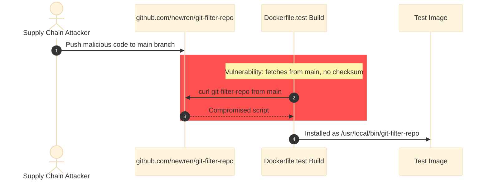

#### Impact

**Likelihood:** Low — git-filter-repo is maintained by Elijah Newren, a Git
project contributor. Compromise is unlikely but not impossible. The test
Dockerfile also has TODO comments acknowledging this risk. Impact is limited to
the test environment.

**Technical:** The script is downloaded from the main branch (no version pin)
and installed to /usr/local/bin. Venom is similarly downloaded without checksum
verification. Both are used only in the test image.

**Business:**
- Financial: N/A -- test environment only
- Regulatory: N/A
- Operational: Compromised test image could produce misleading test results
- Reputational: N/A

**If not remediated:** Test image downloads depend on unverified upstream
content.

#### Mitigations

**Preventive controls:**
- **Pin downloads to tagged releases with checksum verification** *(effort: S)*
  → step 2: Pin git-filter-repo to a tagged release URL and verify SHA256. Pin
  venom to a specific version (not /latest/).

**Detective controls:**

#### Compliance Mapping

- OWASP Top 10 A06:2021 - Vulnerable and Outdated Components — 

#### Risk Treatment

- **Decision:** 
- **Rationale:** 
- **Authority:** 
- **Residual risk score:** 
- **Review date:** 

#### Ticket

**Pin test Dockerfile downloads to versioned URLs with checksums**

tests/Dockerfile.test fetches git-filter-repo from main branch and venom from
/latest/ without integrity verification. Pin to specific versions with SHA256
checks.

**Steps to reproduce:**
1. Inspect tests/Dockerfile.test lines 18 and 26
1. Note the use of /main/ and /latest/ URLs without checksums

**Acceptance criteria:**
- [ ] git-filter-repo is pinned to a tagged release with SHA256 verification
- [ ] venom is pinned to a specific version with SHA256 verification

**Labels:** 
**Assignee team:** 

---

### 🟢 RIOTBOX-20260312-018: System prompt override via LLM-writable path in inject-claude-md.sh priority chain

**Severity:** Low &nbsp;|&nbsp; **Risk Score:** 6 (L2 × I3) &nbsp;|&nbsp;
**Status:** Open

#### System Context

- **Service:** Container Runtime
- **Affected components:** container/inject-claude-md.sh
- **Attack surface:** Application

#### Evidence

- **Source:** manual
- **Rule / Check ID:** N/A
- **CVE ID:** N/A
- **Locations:**
  - `/workspace/container/inject-claude-md.sh:18` — `if [ -f
    "${HOME}/.riotbox/CLAUDE.md" ]; then`
  - `/workspace/container/inject-claude-md.sh:19` —
    `RIOTBOX_PROMPT="${HOME}/.riotbox/CLAUDE.md"`

#### Asset & Security Criteria

- **Business asset:** Integrity of the system prompt controlling LLM behavior
- **IS asset:** CLAUDE.md system prompt file
- **Criteria violated:** Integrity

#### Misuser Profile

- **Actor:** Prompt-injected LLM inside the container
- **Motivation:** Override security instructions in the system prompt to enable
  further malicious actions
- **Capability required:** Low -- the LLM has write access to ~/.riotbox/

#### Threat Classification

- **Spoofing**: ✗ — No identity component
- **Tampering**: ✓ — LLM can write a custom CLAUDE.md that removes security
  guardrails
- **Repudiation**: ✓ — The override file persists in the container but is lost
  on exit (ephemeral overlay)
- **Information Disclosure**: ✗ — N/A
- **Denial Of Service**: ✗ — N/A
- **Elevation Of Privilege**: ✓ — A modified system prompt could instruct Claude
  Code to take otherwise-avoided actions

#### Preconditions (Vulnerabilities)

- LLM is prompt-injected and writes ~/.riotbox/CLAUDE.md
- The entrypoint is re-invoked (new session in same container, which is unlikely
  in normal use) OR the override is set before the entrypoint's inject step

#### Attack Path

**Primary:**
1. LLM is prompt-injected via a project file
2. LLM writes a malicious CLAUDE.md to ~/.riotbox/CLAUDE.md removing security
   instructions
3. On next entrypoint invocation (or if the container is reused),
   inject-claude-md.sh resolves the user-writable path first
4. The system prompt now contains attacker-controlled instructions

**Attack chaining:**
- Enabled by: ['None']
- Enables: ['None']

#### Attack Sequence

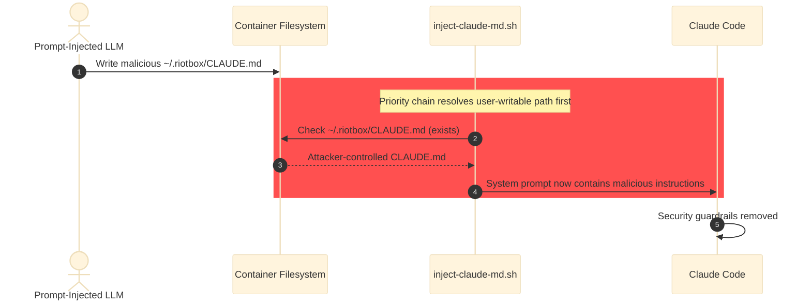

#### Impact

**Likelihood:** Low — The attack requires the LLM to write a file AND the
entrypoint to re-run. In normal use, the entrypoint runs once at container start
before the LLM has any opportunity to write files. The container is ephemeral
(--rm), so the override does not persist across sessions. The main risk is if
the container is reused or if the inject script is re-sourced during a session.
Also, the LLM already has full shell access, so overriding the system prompt
provides limited additional capability beyond what it already has.

**Technical:** inject-claude-md.sh checks ~/.riotbox/CLAUDE.md before
/etc/riotbox/CLAUDE.md. The LLM has write access to ~/.riotbox/ (it is under
$HOME). However, the inject script runs during entrypoint.sh before the LLM
starts, so the timing window is narrow. The RIOTBOX_PROMPT env var can also
override, but it must be set before the entrypoint runs.

**Business:**
- Financial: N/A -- limited additional impact beyond existing LLM capabilities
- Regulatory: N/A
- Operational: System prompt integrity is a defense-in-depth measure
- Reputational: N/A

**If not remediated:** The system prompt resolution chain includes a
user-writable path, which could theoretically be exploited. Practical impact is
low due to timing constraints.

#### Mitigations

**Preventive controls:**
- **Make system prompt path read-only or use only the /etc path** *(effort: S)*
  → step 3: Remove the ~/.riotbox/CLAUDE.md check from inject-claude-md.sh and
  only use /etc/riotbox/CLAUDE.md (which is baked into the image and not
  writable without sudo). Or create ~/.riotbox/ as root-owned and not writable
  by the claude user.

**Detective controls:**

#### Compliance Mapping

- OWASP Top 10 A01:2021 - Broken Access Control — 

#### Risk Treatment

- **Decision:** 
- **Rationale:** 
- **Authority:** 
- **Residual risk score:** 
- **Review date:** 

#### Ticket

**Remove user-writable path from system prompt resolution chain**

inject-claude-md.sh checks ~/.riotbox/CLAUDE.md before /etc/riotbox/CLAUDE.md.
Since the LLM has write access to ~/,  it could theoretically create an
override. Remove the user-writable path or make it root-owned.

**Steps to reproduce:**
1. Inside the container: mkdir -p ~/.riotbox && echo 'malicious prompt' >
   ~/.riotbox/CLAUDE.md
1. Re-run the inject script: source ~/.riotbox/inject-claude-md.sh
1. Check ~/.claude/CLAUDE.md -- verify it contains the malicious prompt

**Acceptance criteria:**
- [ ] System prompt is resolved only from /etc/riotbox/CLAUDE.md or an explicit
  RIOTBOX_PROMPT override
- [ ] ~/.riotbox/CLAUDE.md is not in the resolution chain

**Labels:** 
**Assignee team:** 

## Controlled Threats

_Threats assessed and found adequately mitigated by existing controls._
_Not Applicable entries are blocked by enforced architectural controls and
excluded from open findings._

| ID     | Threat                                                                               | Component                                                  | Inherent   | Residual | Status               | Controls in Place                                                                                                                                                                                                                                                                                                                                                                                                       | Verified By |
| ------ | ------------------------------------------------------------------------------------ | ---------------------------------------------------------- | ---------- | -------- | -------------------- | ----------------------------------------------------------------------------------------------------------------------------------------------------------------------------------------------------------------------------------------------------------------------------------------------------------------------------------------------------------------------------------------------------------------------- | ----------- |
| CT-001 | Secrets baked into container image during build                                      | Dockerfile, .dockerignore                                  | 🔴 Critical | 🟢 Low    | ✅ Controlled         | .dockerignore excludes .env, *.pem, *.key, *.token, credentials*, secrets*, .gitconfig; Dockerfile does not COPY any credential files; secrets are mounted at runtime only; Comment in Dockerfile line 4 explicitly states secrets are never baked in                                                                                                                                                                   | code_review |
| CT-002 | Host SSH keys, GPG keys, cloud credentials, or Kubernetes config stolen by container | scripts/detect-mounts.sh                                   | 🔴 Critical | 🟢 Low    | ✅ Controlled         | detect-mounts.sh uses an allowlist approach -- only explicitly listed directories are mounted; Sensitive directories (.ssh, .gnupg, .kube, .aws, .config/gcloud, .docker/config.json, .azure, .oci, .vault-token, .netrc) are documented as never mounted; Functional mounts are limited to ~/bin (read-only)                                                                                                           | code_review |
| CT-003 | Telemetry or tracking data exfiltrated from container sessions                       | container/entrypoint.sh                                    | 🟡 Medium   | N/A      | 🚫 Not Applicable     | entrypoint.sh lines 12-14: DISABLE_TELEMETRY=1, CLAUDE_CODE_DISABLE_TELEMETRY=1, DO_NOT_TRACK=1; CLAUDE_CODE_SKIP_UPDATE_CHECK=1 prevents update-check network calls                                                                                                                                                                                                                                                    | code_review |
| CT-004 | Container git identity (claude@riotbox) commits pushed to remote repositories        | hooks/pre-push                                             | 🟡 Medium   | 🟢 Low    | ✅ Controlled         | hooks/pre-push blocks pushes containing commits with claude@riotbox or riotbox@local author email; scripts/reown-commits.sh provides a workflow to rewrite commit authorship before pushing; install-hooks task automates hook installation                                                                                                                                                                             | code_review |
| CT-005 | Cross-session conversation history or credential leakage between projects            | scripts/mount-projects.sh, scripts/sync-claude-settings.sh | 🟠 High     | 🟢 Low    | ✅ Controlled         | mount-projects.sh creates per-project session directories under ~/.claude-riotbox/ with 700 permissions; The real ~/.claude directory is never mounted; each session gets its own isolated directory; CLAUDE_CONFIG_DIR is set in entrypoint.sh to point to the session directory; .credentials.json is the only file bind-mounted RW from the host; all other config is copied                                         | code_review |
| CT-006 | Container modifies host directories in audit/read-only mode                          | scripts/mount-projects.sh                                  | 🟠 High     | 🟢 Low    | ✅ Controlled         | RIOTBOX_READONLY=1 changes mount suffix to :ro,z (mount-projects.sh line 147); Read-only mount is enforced at the container runtime level                                                                                                                                                                                                                                                                               | code_review |
| CT-007 | Destructive git operations (force push, delete branches) from within container       | Dockerfile (git config)                                    | 🟡 Medium   | 🟡 Medium | Partially Controlled | receive.denyNonFastForwards=true prevents non-fast-forward pushes (Dockerfile line 290); receive.denyDeletes=true prevents branch deletion via push (Dockerfile line 291); Session branch mechanism uses --ff-only merge (session-branch.sh line 105)                                                                                                                                                                   | code_review |
| CT-008 | Shell variable word-splitting in launch.sh enables argument injection                | .taskfiles/scripts/launch.sh                               | 🟡 Medium   | 🟢 Low    | ✅ Controlled         | All word-split variables (PROJECT_VOLUME_FLAGS, MOUNTS, NESTED_FLAGS, NET_FLAG) are populated by trusted scripts (mount-projects.sh, detect-mounts.sh); mount-projects.sh documents the space limitation and uses sanitized project paths (line 17-21); shellcheck disable=SC2086 comment acknowledges intentional word splitting; DOCKER_EXTRA_ARGS only used in build.sh (not launch.sh) and defaults to empty        | code_review |
| CT-009 | Non-git-tracked files not covered by git-based backup mechanism                      | .taskfiles/scripts/run.sh                                  | 🟡 Medium   | 🟡 Medium | ⚠️ Risk Accepted     | Backup mechanism creates checkpoint commits that include all tracked files; git add -A before checkpoint captures staged and unstaged changes to tracked files; The container is disposable (--rm); untracked artifacts can be regenerated                                                                                                                                                                              | code_review |
| CT-010 | Predictable session directory key enables pre-population attack                      | scripts/mount-projects.sh                                  | 🟢 Low      | 🟢 Low    | 🚫 Not Applicable     | Session directory (~/.claude-riotbox/<key>) is on the host filesystem, outside the container; mkdir -p + chmod 700 ensures correct ownership and permissions (mount-projects.sh lines 163-164); The session key is deterministic from project paths but pre-population requires host-level write access to ~/.claude-riotbox/; A malicious project file inside the container cannot write to the host session directory | code_review |
| CT-011 | LLM modifies or deletes host project files via read-write bind mount                 | scripts/mount-projects.sh, container/claude-wrapper.sh     | 🟠 High     | 🟡 Medium | ⚠️ Risk Accepted     | Local bare backup (git push --force to ~/.claude-riotbox/backups/) before every run; Checkpoint tags (claude-checkpoint/<timestamp>) on current HEAD before run; Session branches offered for interactive shell sessions; Container isolation from host credentials (.ssh, .gnupg, .kube, .aws); Non-git-repo warning when checkpoint protection is unavailable; RIOTBOX_READONLY=1 option for audit/read-only sessions | code_review |
| CT-012 | API key exposed to all container processes via environment variable                  | .taskfiles/scripts/launch.sh                               | 🟡 Medium   | 🟢 Low    | ⚠️ Risk Accepted     | Container is disposable (--rm) and single-purpose; API key only accessible within the container boundary; OAuth token alternative documented and supported; Container cannot access host network credentials                                                                                                                                                                                                            | code_review |
| CT-013 | SELinux confinement disabled in nested container mode                                | .taskfiles/scripts/launch.sh                               | 🟠 High     | 🟡 Medium | ⚠️ Risk Accepted     | Opt-in only via explicit RIOTBOX_NESTED=1 or nested-run/nested-shell commands; README WARNING box documents the security reduction; Rootless podman still enforces user namespace isolation; No --privileged flag; only --device /dev/fuse and label=disable                                                                                                                                                            | code_review |
| CT-014 | LLM can bypass git guardrails via local operations not covered by receive.deny*      | Dockerfile (git config), container/session-branch.sh       | 🟡 Medium   | 🟢 Low    | ⚠️ Risk Accepted     | Local bare backup outside container mount tree (Claude cannot access it); Checkpoint tags survive history rewrites; README documents: "Claude can rewrite git history. Force-pushes, rebases, and git reset --hard are all available"; README documents: "the riotbox includes several layers of protection, but none are foolproof"                                                                                    | code_review |
| CT-015 | Runtime package installation by LLM including potentially malicious packages         | container/CLAUDE.md (system prompt)                        | 🟡 Medium   | 🟢 Low    | ⚠️ Risk Accepted     | Container isolation — packages cannot affect host; Container is disposable (--rm) — packages do not persist outside named cache volumes; System prompt: "You have FULL permission to install packages...Do not ask"; README: "Claude can install arbitrary packages...These run inside the container and can't affect the host"; Named cache volumes can be pruned (podman volume rm)                                   | code_review |
| CT-016 | Taskfile dotenv injection via .env file overriding container launch parameters       | Taskfile.yml                                               | 🟠 High     | 🟢 Low    | 🚫 Not Applicable     | claude-riotbox CLI uses --taskfile to pin Taskfile resolution to the installation directory; Taskfile dotenv resolves relative to Taskfile directory, not CWD — project .env files are never loaded; .dockerignore excludes configs/.env* patterns; dotenv is a standard Taskfile pattern for local development overrides                                                                                               | code_review |
| CT-017 | Backup force-push overwrites previous known-good checkpoint state                    | .taskfiles/scripts/run.sh                                  | 🟡 Medium   | 🟢 Low    | ⚠️ Risk Accepted     | Checkpoint tags (claude-checkpoint/<timestamp>) created before each run and survive force-push; Tags pushed separately via git push --tags (non-destructive, does not delete existing tags); Backup bare repo is outside container mount tree (Claude cannot access it); README documents recovery via: git fetch ~/.claude-riotbox/backups/<project>.git --all --tags                                                  | code_review |
