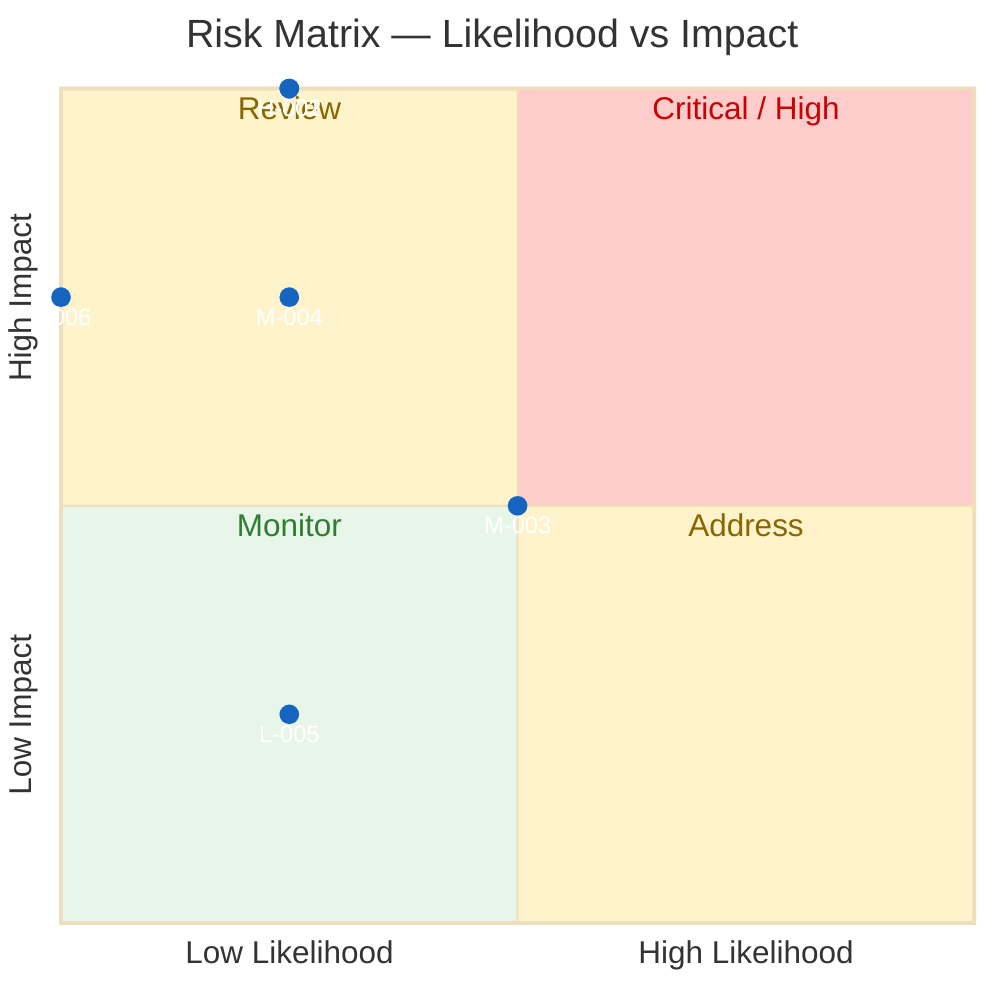
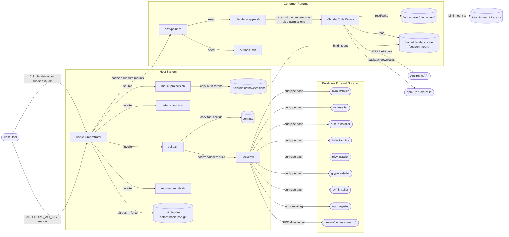
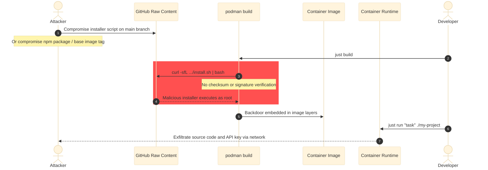
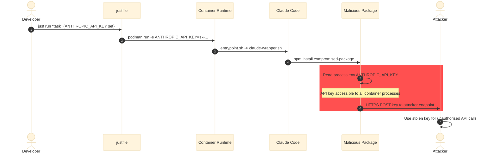
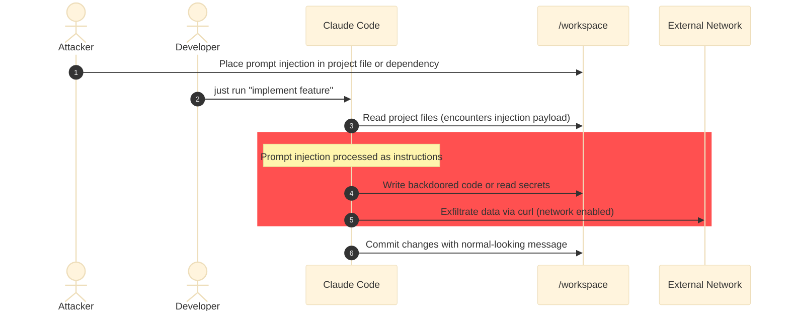
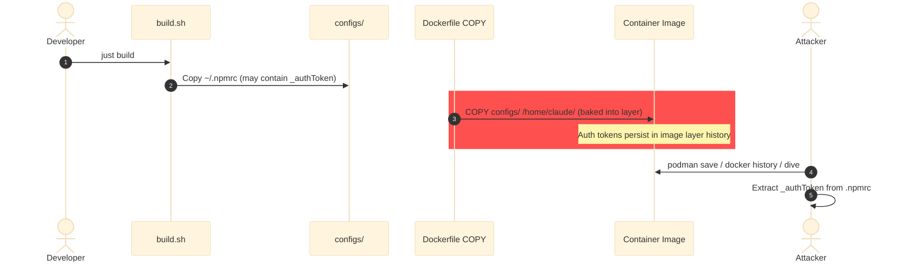
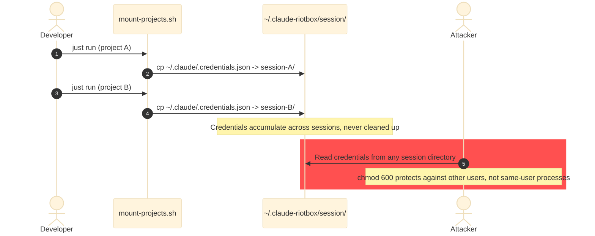
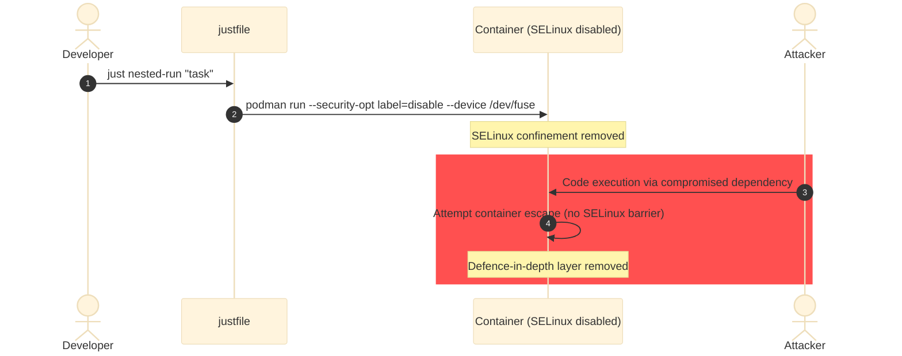

# Threat Model: Claude_Sandbox

> 🤖 **AI-GENERATED REPORT** 🤖
>
> This threat model was produced by **Claude (claude-opus-4-6)** using a static analysis
> methodology. It has not been validated by a human security engineer.
> Findings should be reviewed and prioritised before acting on them.
> Absence of a finding does not imply absence of risk.
>
> 🤖 **AI-GENERATED REPORT** 🤖

---

> **How to read this report**
>
> This report uses a **misuse case** methodology. Each finding describes a specific
> attacker, their goal, the path they would take through the system, and the concrete
> steps required to fix the problem. This is intentional — a finding without a realistic
> attacker and a traversable attack path is noise, not signal.
>
> **Risk Score** = Likelihood (1–5) × Impact (1–5).
> Severity thresholds: Critical 20–25 · High 12–19 · Medium 6–11 · Low 1–5.
> Scores reflect the deployment context described in the scope section — the same
> vulnerability may score differently in a different environment.
>
> **STRIDE** classifies threats by type: Spoofing, Tampering, Repudiation,
> Information Disclosure, Denial of Service, Elevation of Privilege.
> Each category is assessed independently; not all apply to every finding.
>
> **LINDDUN** assesses privacy threats where the system handles personal data,
> behavioural data, or regulated information.
>
> **Controlled Threats** (at the end of this report) are threats that were assessed
> and found to be adequately mitigated by existing controls. They are included as a
> gap analysis record — evidence of what was examined, not just what was found open.
> Not Applicable entries are blocked by enforced architectural controls.

## Assessment Metadata

| Field               | Value                    |
|---------------------|--------------------------|
| **Repository**      | Claude_Sandbox           |
| **Commit**          | `5b942f1`                |
| **Assessment Date** | 2026-03-06               |
| **Analyst**         | Claude (claude-opus-4-6) |
| **Confidence**      | Medium                   |

## Scope

Full repository. All shell scripts, Dockerfile, justfile, and container entrypoint/wrapper scripts assessed. No application-language source code present (project is entirely shell and Dockerfile). Semgrep yielded zero findings because the codebase has no files in semgrep-supported languages beyond shell (which has limited rule coverage). Confidence capped at Medium due to the shell-heavy nature limiting SAST effectiveness.

## Analysis Tools

| Tool    | Version   | Configuration                                                  | Result                                                                             |
|---------|-----------|----------------------------------------------------------------|------------------------------------------------------------------------------------|
| semgrep | `1.154.0` | configs: auto (includes p/default, p/owasp-top-ten, p/secrets) | 0 findings - codebase is shell scripts and Dockerfile only; limited rule coverage  |
| trivy   | `0.69.3`  | scanners: vuln, secret, misconfig                              | 1 LOW misconfiguration (DS-0026: no HEALTHCHECK in Dockerfile); 0 vulns; 0 secrets |
| syft    | `1.42.1`  |                                                                | 0 packages detected - no application dependency manifests present                  |
| grype   | `0.109.0` |                                                                | 0 vulnerability matches                                                            |

## Not Assessed

| Area                                              | Reason                                                                                                                                                           | Gap Type    | Recommended Action                                                                                                       |
|---------------------------------------------------|------------------------------------------------------------------------------------------------------------------------------------------------------------------|-------------|--------------------------------------------------------------------------------------------------------------------------|
| Runtime and dynamic behaviour                     | Static analysis only - no DAST or container runtime testing performed                                                                                            | Methodology | Run container with test harness; verify mount isolation, network policy enforcement, and privilege boundaries at runtime |
| Social engineering and physical vectors           | Outside scope of static analysis methodology                                                                                                                     | Methodology | Address in security awareness and physical security programme                                                            |
| Third-party and vendor code not in the repository | npm-installed @anthropic-ai/claude-code, nvm, uv, rustup, RVM, trivy, grype, syft, and bats are fetched at build time but their source is not in this repository | Methodology | Audit upstream dependencies separately; consider SBOM generation for the built container image                           |
| Shell script injection and argument handling      | Semgrep has limited shell/bash rule coverage; many injection patterns in shell scripts are not detectable by available SAST rules                                | Tooling     | Use ShellCheck with stricter rulesets and manual review of variable expansion in command construction                    |
| Container image contents at runtime               | SBOM was generated against the source directory, not the built container image; runtime dependencies (dnf packages, npm globals) are not inventoried             | Tooling     | Run syft and grype against the built container image (syft docker:claude-riotbox) to inventory all runtime packages      |

## Finding Summary

| Severity    | Count |
|-------------|-------|
| 🔴 Critical | 0     |
| 🟠 High     | 2     |
| 🟡 Medium   | 2     |
| 🟢 Low      | 2     |
| **Total**   | **6** |

## Risk Matrix

## Data Flow Diagram

## Findings

---

### 🟠 CLAUDE-SANDBOX-20260306-001: Unpinned base image and installer scripts enable supply chain compromise during build

**Severity:** High &nbsp;|&nbsp; **Risk Score:** 10 (L2 × I5) &nbsp;|&nbsp; **Status:** Open

#### System Context

- **Service:** container-build
- **Affected components:** Dockerfile:17, Dockerfile:24, Dockerfile:29, Dockerfile:34, Dockerfile:45, Dockerfile:179, Dockerfile:199, Dockerfile:206, Dockerfile:224, Dockerfile:360
- **Attack surface:** Supply Chain

#### Evidence

- **Source:** architecture
- **Rule / Check ID:** N/A
- **CVE ID:** N/A
- **Locations:**
  - `Dockerfile:17` — `FROM quay.io/centos/centos:stream10 AS tools`
  - `Dockerfile:45` — `FROM quay.io/centos/centos:stream10 AS runtime`
  - `Dockerfile:24` — `RUN curl -sfL https://raw.githubusercontent.com/aquasecurity/trivy/main/contrib/install.sh | sh -s -- -b /tools/bin`
  - `Dockerfile:360` — `RUN npm install -g @anthropic-ai/claude-code && claude --version`

#### Asset & Security Criteria

- **Business asset:** Container image integrity - the guarantee that the built riotbox image contains only intended, untampered software and will not execute attacker-supplied code when a developer runs it.

- **IS asset:** Dockerfile build pipeline and resulting container image
- **Criteria violated:** Integrity

#### Misuser Profile

- **Actor:** Supply chain attacker who compromises an upstream dependency source (GitHub raw content, npm registry, quay.io container registry, or installer CDN)

- **Motivation:** Gain code execution inside developer containers to steal API keys, exfiltrate source code from mounted project directories, or implant backdoors in developer projects.

- **Capability required:** Ability to compromise one of: a GitHub repository default branch (for installer scripts), the npm registry entry for @anthropic-ai/claude-code, or the quay.io CentOS Stream 10 tag. Nation-state or well-resourced attacker capability.

#### Threat Classification

- **Spoofing**: ✓ — A compromised upstream source can spoof a legitimate installer script or container image, and the build process cannot distinguish it from the real one because no signature or digest verification occurs.

- **Tampering**: ✓ — The fetched scripts, packages, and base image can be tampered with at the source or in transit (for HTTP endpoints), and the Dockerfile does not verify checksums or signatures.

- **Repudiation**: ✗ — Build logs record what was fetched but cannot prove the content was authentic; however, repudiation is not the primary concern here.

- **Information Disclosure**: ✗ — The build process itself does not expose sensitive data; the risk is code execution, not disclosure during build.

- **Denial Of Service**: ✗ — A compromised dependency could break the build, but denial of service is not the attacker likely goal when they have code execution.

- **Elevation Of Privilege**: ✓ — Malicious code injected during build executes as root (in the tools stage) or as the claude user with passwordless sudo, gaining full control over the container and access to all mounted host directories.

#### Preconditions (Vulnerabilities)

- Base image FROM tags are not pinned to a specific digest (Dockerfile lines 17, 45)
- Seven installer scripts are fetched via curl and piped directly to bash/sh without checksum or signature verification
- The @anthropic-ai/claude-code npm package is installed without a version pin (Dockerfile line 360)
- No content-addressable verification (SHA256, GPG) on any fetched artifact

#### Attack Path

**Primary:**
1. Attacker compromises the main branch of a GitHub repository hosting an installer script (e.g., aquasecurity/trivy, anchore/grype, anchore/syft, nvm-sh/nvm) or performs a registry account takeover.

2. Developer runs "just build" or "just rebuild", triggering the Dockerfile build. The compromised installer script is fetched via curl and piped to bash (e.g., Dockerfile line 24).

3. Malicious code executes during image build with root privileges (in the tools stage) or claude user privileges (in the runtime stage), embedding a backdoor in the image.

4. When the developer runs "just run", the backdoored container executes with the host project directory bind-mounted at /workspace and the Anthropic API key in the environment, allowing exfiltration of source code and credentials.

**Alternative paths:**
- Alt A (npm supply chain): Attacker compromises the @anthropic-ai/claude-code npm package. Since line 360 installs without a version pin, any published version (including a malicious one) will be installed at build time.

- Alt B (base image tag poisoning): Attacker pushes a malicious image to quay.io/centos/centos:stream10 or poisons the local image cache. Since no digest is pinned, the build pulls the malicious image.

**Attack chaining:**
- Enabled by: None
- Enables: CLAUDE-SANDBOX-20260306-002

#### Attack Sequence

#### Impact

**Likelihood:** Low — Requires compromising a well-maintained upstream repository or registry, which is a high-capability attack. However, this is a single-user dev tool where builds are infrequent, further reducing the window of opportunity. Likelihood 2/5.

**Technical:** Full code execution in the container at build time (as root in stage 1) and at runtime (as claude with passwordless sudo). Attacker gains access to all bind-mounted project directories and any environment variables including ANTHROPIC_API_KEY.

**Business:**
- Financial: Potential theft of proprietary source code and API keys; cost of incident response and key rotation.

- Regulatory: If mounted projects contain regulated data, a supply chain compromise could trigger breach notification obligations.

- Operational: All containers built from the compromised image are affected; requires full image rebuild from verified sources and audit of all projects that were mounted during the compromise window.

- Reputational: Supply chain compromises in developer tooling erode trust in the tool and its maintainer.

**If not remediated:** The attack surface grows as more installer scripts are added. Known supply chain attacks against npm (event-stream), GitHub Actions (codecov), and container registries demonstrate this is a realistic and actively exploited vector.

#### Mitigations

**Preventive controls:**
- **Pin base image to specific digest** *(effort: S)* → step 2: Change both FROM lines to use digest pinning: FROM quay.io/centos/centos:stream10@sha256:<digest> AS tools. Run: podman inspect quay.io/centos/centos:stream10 --format '{{index .RepoDigests 0}}' to get the current digest. Update the digest on a scheduled cadence (monthly or on security advisories).

- **Download installer scripts with checksum verification** *(effort: M)* → step 2: For each curl | bash pattern, download the script to a file first, verify its SHA256 against a known-good hash committed in the repository, then execute. Example: RUN curl -sfL https://...install.sh -o /tmp/install.sh && echo "<expected-sha256> /tmp/install.sh" | sha256sum -c - && sh /tmp/install.sh -b /tools/bin

- **Pin @anthropic-ai/claude-code to a specific version** *(effort: S)* → step 2: Change Dockerfile line 360 to: RUN npm install -g @anthropic-ai/claude-code@<version>. Pin to a known-good version and update deliberately.

**Detective controls:**
- **Verify built image SBOM against known-good baseline** *(effort: M)* → step 3: After each build, run syft against the image and diff the SBOM against a committed baseline. Alert on unexpected new packages or version changes.

#### Compliance Mapping

- OWASP Top 10 A08:2021 — Software and Data Integrity Failures
- NIST 800-53 SA-12 — Supply Chain Protection
- CIS Docker Benchmark 4.7 — Ensure update instructions are not used alone in the Dockerfile

#### Risk Treatment

- **Decision:** Reduce
- **Rationale:** Digest pinning and version pinning are low-effort changes that significantly reduce the supply chain attack surface. Checksum verification of installer scripts is moderate effort but addresses the highest-risk curl | bash patterns.

- **Authority:** Project Maintainer
- **Residual risk score:** 4
- **Review date:** 2026-06-06

#### Ticket

**CLAUDE-SANDBOX-20260306-001: Unpinned base image and installer scripts enable supply chain compromise during build**

The Dockerfile uses unpinned FROM tags for the CentOS Stream 10 base image, pipes seven installer scripts from GitHub directly to bash without checksum verification, and installs @anthropic-ai/claude-code from npm without a version pin. If any upstream source is compromised, malicious code executes during image build with root or sudo-capable privileges and persists in every container launched from that image.

**Steps to reproduce:**
1. Review Dockerfile lines 17 and 45 - FROM quay.io/centos/centos:stream10 with no @sha256 digest.
1. Review Dockerfile lines 24, 29, 34, 179, 199, 206, 224 - curl ... | bash with no checksum.
1. Review Dockerfile line 360 - npm install -g @anthropic-ai/claude-code with no version pin.
1. Run just build and observe that all artifacts are fetched without integrity verification.

**Acceptance criteria:**
- [ ] Both FROM statements include @sha256 digest pinning.
- [ ] All curl-piped installer scripts are downloaded to a file, checksummed against a committed hash, then executed.
- [ ] The @anthropic-ai/claude-code package is pinned to a specific version in the npm install command.
- [ ] A CI check or build-time script verifies digests and checksums.

**Labels:** `severity:high`, `threat-model`, `supply-chain`, `container-build`
**Assignee team:** Project Maintainer

---

### 🟠 CLAUDE-SANDBOX-20260306-002: API key exposed in container environment enables exfiltration by compromised dependencies

**Severity:** High &nbsp;|&nbsp; **Risk Score:** 10 (L2 × I5) &nbsp;|&nbsp; **Status:** Open

#### System Context

- **Service:** container-runtime
- **Affected components:** justfile:63, container/claude-wrapper.sh:70-73, container/entrypoint.sh:12-14
- **Attack surface:** Container

#### Evidence

- **Source:** architecture
- **Rule / Check ID:** N/A
- **CVE ID:** N/A
- **Locations:**
  - `justfile:63` — `${ANTHROPIC_API_KEY:+-e ANTHROPIC_API_KEY="$ANTHROPIC_API_KEY"}`
  - `container/claude-wrapper.sh:71` — `--dangerously-skip-permissions \`

#### Asset & Security Criteria

- **Business asset:** Anthropic API key - the credential that authorises API usage and is billed to the developer account. Compromise enables unauthorised usage at the developer expense.

- **IS asset:** ANTHROPIC_API_KEY environment variable inside container
- **Criteria violated:** Confidentiality

#### Misuser Profile

- **Actor:** Malicious or compromised npm/pip/cargo package installed by Claude Code inside the container during autonomous task execution

- **Motivation:** Exfiltrate API keys for resale, cryptocurrency mining via API abuse, or to enable further attacks using the developer identity.

- **Capability required:** Ability to read environment variables from within the container process tree (trivially available to any code running as the claude user) and make outbound HTTPS requests (network is enabled by default).

#### Threat Classification

- **Spoofing**: ✓ — With the stolen API key, an attacker can impersonate the developer when making Anthropic API calls.
- **Tampering**: ✗ — The API key enables read/query access to the Anthropic API; tampering with the developer account settings requires additional credentials.
- **Repudiation**: ✓ — API calls made with the stolen key are attributed to the developer account, making it difficult to distinguish legitimate from fraudulent usage.
- **Information Disclosure**: ✓ — The API key is exposed to every process in the container via the environment, and network access is enabled by default for exfiltration.
- **Denial Of Service**: ✓ — An attacker could exhaust the developer API quota or trigger rate limits, effectively denying the developer access to the Anthropic API.
- **Elevation Of Privilege**: ✗ — The API key provides API access, not privilege escalation within the container or host system.

#### Preconditions (Vulnerabilities)

- ANTHROPIC_API_KEY is set in the host environment and passed through to the container via -e flag
- Container network is enabled by default (RIOTBOX_NETWORK is not set to "none")
- Claude Code operates with --dangerously-skip-permissions, allowing it to install arbitrary packages that can read environment variables
- The container has passwordless sudo, allowing any process to inspect /proc/*/environ

#### Attack Path

**Primary:**
1. Developer runs "just run" with ANTHROPIC_API_KEY set in the host environment. The justfile passes it to the container via -e flag.

2. Claude Code, running with --dangerously-skip-permissions, installs an npm/pip/cargo package as part of its autonomous task execution. The package includes a postinstall hook or import-time side effect.

3. The malicious package reads process.env.ANTHROPIC_API_KEY (or equivalent in other languages) and exfiltrates it via an HTTPS POST to an attacker-controlled endpoint.

4. Attacker uses the stolen API key to make Anthropic API calls at the developer expense.

**Alternative paths:**
- Alt A: Any process in the container can read /proc/1/environ (or its own /proc/self/environ) to obtain the API key, even without it being explicitly passed to the child process.
- Alt B: The key is visible via "podman inspect" on the host, exposing it to any host process that can run container management commands.

**Attack chaining:**
- Enabled by: CLAUDE-SANDBOX-20260306-001
- Enables: None

#### Attack Sequence

#### Impact

**Likelihood:** Low — Requires a supply chain compromise of a package that Claude Code installs, AND the developer must have ANTHROPIC_API_KEY set as an environment variable (as opposed to using OAuth token auth). This is a single-user dev tool, limiting exposure. Likelihood 2/5.

**Technical:** Full Anthropic API access under the developer identity. The key cannot be scoped or restricted per-container.

**Business:**
- Financial: Unauthorised API usage billed to the developer account; potential for significant charges depending on usage volume and detection time.
- Regulatory: Minimal regulatory exposure unless the API is used to process regulated data.
- Operational: API key must be rotated immediately upon detection; all active containers must be stopped and rebuilt.
- Reputational: Limited - single-user tool; no customer-facing impact.

**If not remediated:** As Claude Code installs more packages autonomously, the probability of encountering a compromised package increases. The --dangerously-skip-permissions flag means there is no human approval step before package installation.

#### Mitigations

**Preventive controls:**
- **Prefer OAuth token auth over API key pass-through** *(effort: S)* → step 1: The tool already supports OAuth via ~/.claude/.credentials.json copied into the session directory. Document OAuth as the recommended auth method and deprecate ANTHROPIC_API_KEY pass-through. Remove the -e ANTHROPIC_API_KEY line from the justfile or gate it behind an explicit opt-in flag.

- **Disable network by default, enable on explicit opt-in** *(effort: M)* → step 3: Change the default in justfile to --network=none unless RIOTBOX_NETWORK=enabled is set. This prevents exfiltration but also blocks package downloads. Consider a split model where network is enabled only during an initial setup phase.

**Detective controls:**
- **Monitor Anthropic API usage for anomalous patterns** *(effort: S)* → step 4: Use the Anthropic usage dashboard or API to alert on usage spikes that exceed normal development patterns.

#### Compliance Mapping

- OWASP Top 10 A07:2021 — Identification and Authentication Failures
- CIS Docker Benchmark 5.11 — Do Not Pass Host Secrets Via Environment Variables

#### Risk Treatment

- **Decision:** Reduce
- **Rationale:** Deprecating API key pass-through in favour of already-supported OAuth tokens is low effort and eliminates the highest-risk credential exposure path.
- **Authority:** Project Maintainer
- **Residual risk score:** 4
- **Review date:** 2026-06-06

#### Ticket

**CLAUDE-SANDBOX-20260306-002: API key exposed in container environment enables exfiltration by compromised dependencies**

When ANTHROPIC_API_KEY is set in the host environment, the justfile passes it to the container via -e flag, making it readable by every process inside the container. Since Claude Code runs with --dangerously-skip-permissions and can install arbitrary packages, a compromised dependency can trivially read and exfiltrate the key.

**Steps to reproduce:**
1. Set ANTHROPIC_API_KEY in the host environment.
1. Run just run "install some-package" to launch a container.
1. Inside the container, run echo $ANTHROPIC_API_KEY - the key is visible.
1. Any process in the container can read /proc/self/environ to obtain the key.

**Acceptance criteria:**
- [ ] ANTHROPIC_API_KEY is not passed via -e environment variable by default.
- [ ] OAuth token authentication via session directory is documented as the recommended method.
- [ ] If API key pass-through is retained, it requires an explicit opt-in flag.

**Labels:** `severity:high`, `threat-model`, `container-runtime`, `credentials`
**Assignee team:** Project Maintainer

---

### 🟡 CLAUDE-SANDBOX-20260306-003: Autonomous agent with unrestricted permissions can modify project files and git history

**Severity:** Medium &nbsp;|&nbsp; **Risk Score:** 9 (L3 × I3) &nbsp;|&nbsp; **Status:** Open

#### System Context

- **Service:** claude-code-wrapper
- **Affected components:** container/claude-wrapper.sh:71, container/claude-wrapper.sh:30-59, container/entrypoint.sh:49
- **Attack surface:** Application

#### Evidence

- **Source:** architecture
- **Rule / Check ID:** N/A
- **CVE ID:** N/A
- **Locations:**
  - `container/claude-wrapper.sh:71` — `--dangerously-skip-permissions \`
  - `container/entrypoint.sh:49` — `"skipDangerousModePermissionPrompt": true,`

#### Asset & Security Criteria

- **Business asset:** Project source code integrity - the guarantee that code in the developer project directories is modified only as intended and that git history accurately reflects the provenance of changes.

- **IS asset:** Bind-mounted project directory at /workspace and its git repository
- **Criteria violated:** Integrity

#### Misuser Profile

- **Actor:** Claude Code LLM agent operating autonomously with unrestricted permissions, influenced by prompt injection via project content (README, comments, issue templates, or fetched web content)

- **Motivation:** An attacker who controls content that Claude Code processes (e.g., a malicious README in a dependency, a crafted issue description, or a webpage fetched during research) can instruct the agent to perform destructive or exfiltrating actions.

- **Capability required:** Ability to place attacker-controlled text in a location Claude Code will read - project files, dependency READMEs, web search results, or issue tracker content. No direct access to the container required.

#### Threat Classification

- **Spoofing**: ✗ — The agent acts under its own identity; there is no identity spoofing involved.
- **Tampering**: ✓ — A prompt-injected agent can tamper with project files, introduce backdoors, modify configuration, or rewrite git history within the container.
- **Repudiation**: ✓ — Changes made by the injected agent appear as normal Claude commits, making it difficult to distinguish legitimate from malicious modifications without careful code review.
- **Information Disclosure**: ✓ — A prompt-injected agent could read sensitive files in the mounted project (e.g., .env files, config with credentials) and exfiltrate them via network requests or by encoding them in commit messages.
- **Denial Of Service**: ✓ — The agent could delete project files, corrupt the git repository, or consume all disk space, causing denial of service for the developer.
- **Elevation Of Privilege**: ✓ — The agent has passwordless sudo and --dangerously-skip-permissions; it already operates at maximum privilege within the container. Prompt injection elevates an external attacker capabilities to match the agent full permissions.

#### Preconditions (Vulnerabilities)

- Claude Code runs with --dangerously-skip-permissions (claude-wrapper.sh line 71)
- skipDangerousModePermissionPrompt is true in settings.json (entrypoint.sh line 49)
- The system prompt instructs Claude to install packages and make changes without asking (claude-wrapper.sh lines 30-59)
- Project directory is mounted read-write by default (mount-projects.sh line 24)
- Network is enabled by default, allowing outbound data exfiltration

#### Attack Path

**Primary:**
1. Attacker places a prompt injection payload in a location Claude Code will process - a README.md in a dependency, a GitHub issue body, a code comment, or a webpage the agent fetches.

2. Developer runs "just run" with the project containing or referencing the malicious content. Claude Code reads the injected instructions.

3. The injected prompt instructs the agent to perform malicious actions: introduce a backdoor in source code, exfiltrate .env files via curl, or delete critical files.

4. The agent executes the instructions with full write access to /workspace and network access, completing the attack.

**Alternative paths:**
- Alt A (audit mode limitation): The audit command mounts projects read-only, but the agent still has network access and can exfiltrate file contents it reads without modifying them.

**Attack chaining:**
- Enabled by: None
- Enables: None

#### Attack Sequence

#### Impact

**Likelihood:** Medium — Prompt injection in LLM agents is a well-documented and actively researched attack vector. The attack surface is broad (any content the agent reads), but exploitation requires the attacker to specifically target projects that will be processed by this tool. Single-user deployment limits exposure. Likelihood 3/5.

**Technical:** Full read-write access to all mounted project files. Ability to install packages, run commands, make network requests, and modify git history. Passwordless sudo provides root-equivalent access within the container.

**Business:**
- Financial: Cost of code audit to identify injected backdoors; potential downstream impact if backdoored code is deployed to production.
- Regulatory: If project contains regulated data, exfiltration triggers breach notification obligations.
- Operational: Recovery requires reverting to the pre-run checkpoint (backup exists at ~/.claude-riotbox/backups/), but the developer must notice the compromise first.
- Reputational: Backdoored open-source contributions could damage the developer professional reputation.

**If not remediated:** As LLM prompt injection techniques mature, the likelihood of successful attacks increases. The --dangerously-skip-permissions flag means there are no guardrails against destructive actions.

#### Mitigations

**Preventive controls:**
- **Default to read-only project mounts with explicit write opt-in** *(effort: S)* → step 4: Change the default mount mode in mount-projects.sh to ":ro,z" and require RIOTBOX_READWRITE=1 to mount read-write. This limits the blast radius of prompt injection to data exfiltration rather than code modification.

- **Disable network by default during autonomous runs** *(effort: M)* → step 4: Set --network=none by default in the justfile for "run" commands. Provide a separate "run-online" command that enables network when the developer explicitly needs package installation.

**Detective controls:**
- **Post-run diff review before accepting changes** *(effort: S)* → step 4: After each "just run", automatically display "git diff claude-checkpoint/<timestamp>..HEAD" and require explicit developer approval before the changes are considered accepted. The checkpoint mechanism already exists; add the review step.

#### Compliance Mapping

- OWASP Top 10 A03:2021 — Injection

#### Risk Treatment

- **Decision:** Reduce
- **Rationale:** The existing checkpoint/backup mechanism provides recovery capability, but prevention (read-only default, network isolation) would reduce the blast radius significantly.
- **Authority:** Project Maintainer
- **Residual risk score:** 4
- **Review date:** 2026-06-06

#### Ticket

**CLAUDE-SANDBOX-20260306-003: Autonomous agent with unrestricted permissions can modify project files and git history**

Claude Code runs with --dangerously-skip-permissions and full read-write access to the project directory. If the agent processes attacker-controlled content (prompt injection via project files, dependencies, or web content), it can modify source code, exfiltrate secrets, or introduce backdoors without any approval step.

**Steps to reproduce:**
1. Create a file in the project with hidden instructions (e.g., an HTML comment in README.md with injected instructions to exfiltrate environment variables).
1. Run just run "review the project" to process the project.
1. Observe whether the agent follows the injected instructions.

**Acceptance criteria:**
- [ ] Project directories are mounted read-only by default for run commands.
- [ ] A post-run diff review step is implemented before changes are accepted.
- [ ] Network isolation (--network=none) is the default for autonomous runs.

**Labels:** `severity:medium`, `threat-model`, `application`, `prompt-injection`
**Assignee team:** Project Maintainer

---

### 🟡 CLAUDE-SANDBOX-20260306-004: Host tool configs copied at build time may contain registry authentication tokens

**Severity:** Medium &nbsp;|&nbsp; **Risk Score:** 8 (L2 × I4) &nbsp;|&nbsp; **Status:** Open

#### System Context

- **Service:** container-build
- **Affected components:** scripts/build.sh:145, scripts/build.sh:154, Dockerfile:330
- **Attack surface:** Supply Chain

#### Evidence

- **Source:** architecture
- **Rule / Check ID:** N/A
- **CVE ID:** N/A
- **Locations:**
  - `scripts/build.sh:145` — `copy_if_exists "${HOME}/.npmrc"              ".npmrc"`
  - `scripts/build.sh:154` — `copy_if_exists "${HOME}/.cargo/config.toml" ".cargo/config.toml"`
  - `Dockerfile:330` — `COPY --chown=claude:claude configs/ /home/claude/`

#### Asset & Security Criteria

- **Business asset:** Private registry credentials - authentication tokens for private npm registries, Cargo registries, or PyPI indexes that may be embedded in tool configuration files on the developer host.

- **IS asset:** Tool configuration files (.npmrc, .cargo/config.toml, pip.conf) baked into image layers
- **Criteria violated:** Confidentiality

#### Misuser Profile

- **Actor:** Anyone with access to the built container image (via a shared registry, a team member pulling the image, or an attacker who gains access to the image layers)
- **Motivation:** Extract private registry credentials to access proprietary packages, internal code, or to pivot into the organisation infrastructure.
- **Capability required:** Access to the built container image and ability to inspect its layers (e.g., podman history, docker save, or dive).

#### Threat Classification

- **Spoofing**: ✓ — Stolen registry tokens allow the attacker to authenticate as the developer to private package registries.
- **Tampering**: ✗ — Registry read tokens do not typically allow package publishing; write tokens would enable tampering.
- **Repudiation**: ✗ — Registry access logs would attribute activity to the developer account, but repudiation is not the primary concern.
- **Information Disclosure**: ✓ — Registry auth tokens embedded in config files are baked into image layers and recoverable by anyone with image access.
- **Denial Of Service**: ✗ — This attack path does not target availability.
- **Elevation Of Privilege**: ✗ — Registry credentials provide registry access, not system privilege.

#### Preconditions (Vulnerabilities)

- Developer ~/.npmrc, ~/.cargo/config.toml, or pip.conf contains authentication tokens for private registries
- build.sh copies these files into configs/ directory at build time
- .dockerignore blocks .env, .pem, .key, .token, and credentials files, but does NOT block .npmrc or .cargo/config.toml
- The files are COPYd into the image at Dockerfile line 330 and persist in image layers

#### Attack Path

**Primary:**
1. Developer runs "just build". build.sh copies ~/.npmrc and ~/.cargo/config.toml into the configs/ directory.
2. The Dockerfile COPY instruction bakes these files into a layer of the container image.
3. An attacker with access to the image (shared registry, teammate, or compromised build server) extracts the image layers and reads the config files containing auth tokens.
4. Attacker uses the tokens to authenticate to the developer private npm/cargo/PyPI registry and download proprietary packages.

**Alternative paths:**
- Alt A: Even if the image is not shared, processes inside the container can read /home/claude/.npmrc and extract the token, combining with CLAUDE-SANDBOX-20260306-002 for exfiltration.

**Attack chaining:**
- Enabled by: None
- Enables: CLAUDE-SANDBOX-20260306-002

#### Attack Sequence

#### Impact

**Likelihood:** Low — Requires the developer to have auth tokens in their .npmrc or .cargo/config.toml (common for enterprise developers with private registries) AND the image to be accessible to an attacker. For a single-user dev tool where the image stays local, the exposure is limited. Likelihood 2/5.

**Technical:** Private registry authentication tokens exposed in container image layers. Tokens may provide read or read-write access to private package registries.

**Business:**
- Financial: Access to proprietary packages; potential for supply chain attacks against the organisation internal packages.
- Regulatory: Credential exposure may violate internal security policies and compliance requirements for credential management.
- Operational: Token rotation required; audit of registry access logs to identify any unauthorised access.
- Reputational: Limited unless the leaked credentials lead to a broader compromise.

**If not remediated:** If the image is ever pushed to a shared or public registry, all embedded credentials are immediately exposed. This is a latent risk that materialises when sharing practices change.

#### Mitigations

**Preventive controls:**
- **Strip auth tokens from config files before copying** *(effort: S)* → step 1: In build.sh, after copying .npmrc, strip lines matching //_authToken or //.*:_authToken. For .cargo/config.toml, strip [registries.*.token] entries. Alternatively, use Docker build secrets (--mount=type=secret) to provide these at build time without baking them into layers.

- **Add .npmrc and .cargo/config.toml to .dockerignore** *(effort: S)* → step 2: Add these patterns to .dockerignore: configs/.npmrc and configs/.cargo/config.toml. Use --mount=type=secret for build-time registry access if needed.

**Detective controls:**
- **Scan built image for secrets before use** *(effort: S)* → step 3: Run "trivy image --scanners secret claude-riotbox" after each build to detect any credentials baked into the image layers.

#### Compliance Mapping

- CIS Docker Benchmark 4.10 — Ensure secrets are not stored in Dockerfiles
- OWASP Top 10 A07:2021 — Identification and Authentication Failures

#### Risk Treatment

- **Decision:** Reduce
- **Rationale:** Stripping auth tokens from config files is a small change that eliminates the credential baking risk entirely.
- **Authority:** Project Maintainer
- **Residual risk score:** 2
- **Review date:** 2026-06-06

#### Ticket

**CLAUDE-SANDBOX-20260306-004: Host tool configs copied at build time may contain registry authentication tokens**

build.sh copies the host user .npmrc and .cargo/config.toml into the container image at build time. These files commonly contain authentication tokens for private registries. The .dockerignore blocks .env and .key files but not these config files, so the tokens are baked into image layers and recoverable by anyone with access to the image.

**Steps to reproduce:**
1. Ensure ~/.npmrc contains an auth token (e.g., //registry.npmjs.org/:_authToken=npm_...).
1. Run just build to build the image.
1. Run podman history claude-riotbox or use dive to inspect image layers.
1. Locate and extract the .npmrc file from the configs/ layer - the auth token is present.

**Acceptance criteria:**
- [ ] build.sh strips authentication tokens from .npmrc before copying to configs/.
- [ ] build.sh strips token entries from .cargo/config.toml before copying.
- [ ] trivy secret scan of the built image reports zero findings.

**Labels:** `severity:medium`, `threat-model`, `supply-chain`, `credentials`
**Assignee team:** Project Maintainer

---

### 🟢 CLAUDE-SANDBOX-20260306-005: OAuth tokens copied to session directory persist on host filesystem without expiry enforcement

**Severity:** Low &nbsp;|&nbsp; **Risk Score:** 4 (L2 × I2) &nbsp;|&nbsp; **Status:** Open

#### System Context

- **Service:** session-management
- **Affected components:** scripts/mount-projects.sh:85-91, scripts/mount-projects.sh:68-70
- **Attack surface:** Application

#### Evidence

- **Source:** architecture
- **Rule / Check ID:** N/A
- **CVE ID:** N/A
- **Locations:**
  - `scripts/mount-projects.sh:85` — `for auth_file in "${HOME}/.claude.json" "${HOME}/.claude/.credentials.json"; do`
  - `scripts/mount-projects.sh:88` — `cp "${auth_file}" "${dest}"`
  - `scripts/mount-projects.sh:89` — `chmod 600 "${dest}"`

#### Asset & Security Criteria

- **Business asset:** Claude Code OAuth tokens - credentials that authenticate the user to the Anthropic API and authorise API usage billed to their account.
- **IS asset:** OAuth credential files in ~/.claude-riotbox/<session-key>/ directories
- **Criteria violated:** Confidentiality

#### Misuser Profile

- **Actor:** Local attacker with access to the developer home directory (a compromised process, a shared workstation, or a backup system that captures home directory contents)
- **Motivation:** Obtain valid Anthropic API credentials for unauthorised use.
- **Capability required:** Read access to ~/.claude-riotbox/ directory on the host filesystem. The files are chmod 600 but the directory is chmod 700, so any process running as the user can read them.

#### Threat Classification

- **Spoofing**: ✓ — Stolen OAuth tokens allow impersonation of the developer when making Anthropic API calls.
- **Tampering**: ✗ — The tokens provide API access, not modification of the session management system.
- **Repudiation**: ✗ — API calls are attributed to the token owner regardless.
- **Information Disclosure**: ✓ — OAuth tokens are copied and persisted on the host filesystem indefinitely, with no automatic cleanup or rotation.
- **Denial Of Service**: ✗ — Token theft does not directly cause denial of service.
- **Elevation Of Privilege**: ✗ — OAuth tokens provide API access at the existing privilege level.

#### Preconditions (Vulnerabilities)

- OAuth credentials exist at ~/.claude.json and ~/.claude/.credentials.json on the host
- mount-projects.sh copies them into ~/.claude-riotbox/<session-key>/ with chmod 600
- No cleanup mechanism removes old session directories or rotates copied tokens
- Multiple session directories may accumulate over time, each containing a copy of the credentials

#### Attack Path

**Primary:**
1. Developer runs "just run" multiple times with different project sets. Each invocation creates a session directory under ~/.claude-riotbox/ containing a copy of the OAuth tokens.
2. Over time, multiple copies of the credentials accumulate in predictable locations on the host filesystem.
3. A local attacker (compromised process, backup exfiltration, or shared workstation) reads the credential files from any session directory.
4. Attacker uses the OAuth tokens to make authenticated API calls.

**Alternative paths:**
- Alt A: Host backup systems (Time Machine, borgbackup, rsync) capture ~/.claude-riotbox/ directories, preserving credentials in backup archives that may have weaker access controls.

**Attack chaining:**
- Enabled by: None
- Enables: None

#### Attack Sequence

#### Impact

**Likelihood:** Low — Requires local access to the developer home directory. For a single-user dev tool on a personal workstation, this typically means another process running as the same user is compromised. The copied tokens are no more exposed than the originals at ~/.claude/.credentials.json — this finding represents marginal additional risk from duplication, not a new exposure class. Likelihood 2/5.

**Technical:** OAuth tokens are copied to session directories on the host filesystem without time-based cleanup. However, an attacker with read access to ~/.claude-riotbox/ already has read access to the original credentials at ~/.claude/. The incremental risk is credential accumulation in predictable locations, not a new attack surface.

**Business:**
- Financial: Unauthorised API usage billed to the developer account.
- Regulatory: Minimal - single-user tool on a personal workstation.
- Operational: Token revocation and session directory cleanup required upon detection.
- Reputational: Limited impact for a single-user tool.

**If not remediated:** Session directories accumulate indefinitely, increasing the number of locations where credentials can be found. If the developer workstation is compromised, stale credentials in old session directories are low-hanging fruit.

#### Mitigations

**Preventive controls:**
- **Implement session directory cleanup with configurable TTL** *(effort: S)* → step 2: Add a cleanup step to mount-projects.sh that removes session directories older than a configurable TTL (e.g., 7 days). Example: find ~/.claude-riotbox/ -maxdepth 1 -type d -mtime +7 -exec rm -rf {} (exclude backups/ directory).

- **Symlink credentials instead of copying where possible** *(effort: M)* → step 2: For podman with --userns=keep-id, investigate whether symlinks to the original credential files work with the UID mapping. This avoids credential duplication. The current code documents why copies are used (permission issues); verify whether recent podman versions have resolved this.

**Detective controls:**
- **Warn on excessive session directory count** *(effort: S)* → step 2: In mount-projects.sh, count existing session directories and emit a warning if more than 10 exist, suggesting cleanup.

#### Compliance Mapping

- OWASP Top 10 A07:2021 — Identification and Authentication Failures

#### Risk Treatment

- **Decision:** Reduce
- **Rationale:** Adding a cleanup TTL is trivial and eliminates credential accumulation. The single-user deployment context makes this a low-urgency improvement.
- **Authority:** Project Maintainer
- **Residual risk score:** 2
- **Review date:** 2026-09-06

#### Ticket

**CLAUDE-SANDBOX-20260306-005: OAuth tokens copied to session directory persist on host filesystem without expiry enforcement**

Each "just run" invocation copies OAuth credentials into a session-specific directory under ~/.claude-riotbox/. These copies accumulate indefinitely with no cleanup mechanism, creating multiple locations where valid credentials can be found by a local attacker.

**Steps to reproduce:**
1. Run just run "task" project-a followed by just run "task" project-b.
1. List session directories: ls ~/.claude-riotbox/ - observe multiple session directories.
1. Check for credential files: find ~/.claude-riotbox -name "*.json" -type f - credentials exist in each.

**Acceptance criteria:**
- [ ] Session directories older than a configurable TTL are automatically cleaned up.
- [ ] A warning is emitted when more than 10 session directories exist.

**Labels:** `severity:medium`, `threat-model`, `application`, `credentials`
**Assignee team:** Project Maintainer

---

### 🟢 CLAUDE-SANDBOX-20260306-006: Nested container mode disables SELinux confinement, reducing host isolation

**Severity:** Low &nbsp;|&nbsp; **Risk Score:** 4 (L1 × I4) &nbsp;|&nbsp; **Status:** Open

#### System Context

- **Service:** container-runtime
- **Affected components:** justfile:56, justfile:138-148
- **Attack surface:** Container

#### Evidence

- **Source:** architecture
- **Rule / Check ID:** N/A
- **CVE ID:** N/A
- **Locations:**
  - `justfile:56` — `NESTED_FLAGS="--device /dev/fuse --security-opt label=disable"`
  - `justfile:143` — `echo "WARNING: Nested container mode disables SELinux confinement (--security-opt label=disable)." >&2`

#### Asset & Security Criteria

- **Business asset:** Host system isolation - the security boundary that prevents a container from accessing host resources beyond its configured mounts.
- **IS asset:** SELinux mandatory access control enforcement on container processes
- **Criteria violated:** Confidentiality, Integrity

#### Misuser Profile

- **Actor:** Attacker who has gained code execution inside the container (via supply chain compromise or prompt injection) and attempts to escape the container to the host.
- **Motivation:** Escalate from container access to host system access for lateral movement, credential theft, or persistent compromise.
- **Capability required:** Code execution inside the container (established via another finding), plus knowledge of container escape techniques that are blocked by SELinux but available when SELinux is disabled.

#### Threat Classification

- **Spoofing**: ✗ — SELinux disablement does not directly enable identity spoofing.
- **Tampering**: ✓ — Without SELinux confinement, container processes may access and modify host filesystem paths that would normally be blocked by mandatory access control.
- **Repudiation**: ✗ — SELinux logging is separate from this concern.
- **Information Disclosure**: ✓ — Disabled SELinux allows container processes to read host files that would be restricted by the container_t SELinux context.
- **Denial Of Service**: ✗ — SELinux does not primarily protect against resource exhaustion.
- **Elevation Of Privilege**: ✓ — Disabling SELinux removes a defence-in-depth layer that prevents container escape; combined with passwordless sudo inside the container, this significantly weakens the isolation boundary.

#### Preconditions (Vulnerabilities)

- Developer explicitly sets RIOTBOX_NESTED=1 or uses "just nested-run" / "just nested-shell"
- --security-opt label=disable is applied, removing SELinux confinement
- --device /dev/fuse is passed, granting access to the FUSE device
- Container user has passwordless sudo

#### Attack Path

**Primary:**
1. Developer runs "just nested-run" to enable podman-in-podman support. The justfile passes --security-opt label=disable.
2. An attacker with code execution inside the container (via prompt injection or compromised dependency) attempts container escape techniques that would normally be blocked by SELinux.
3. Without SELinux confinement, the attacker can access host filesystem paths, device nodes, or kernel interfaces that the container_t SELinux context would have restricted.

**Attack chaining:**
- Enabled by: CLAUDE-SANDBOX-20260306-001
- Enables: None

#### Attack Sequence

#### Impact

**Likelihood:** Low — Requires the developer to explicitly opt into nested mode (non-default behaviour) AND an attacker to have code execution inside the container AND a container escape technique that is specifically blocked by SELinux but not by other isolation mechanisms. Likelihood 1/5.

**Technical:** Removal of SELinux mandatory access control on container processes. Combined with passwordless sudo, this reduces the container-to-host isolation to namespace and cgroup boundaries only.

**Business:**
- Financial: Minimal direct financial impact unless container escape leads to host compromise.
- Regulatory: Relevant if the host processes regulated data and the container escape exposes it.
- Operational: Host compromise would require full incident response.
- Reputational: Limited - requires explicit opt-in by the developer.

**If not remediated:** The warning message in the justfile documents the risk. However, developers may use nested mode routinely for convenience, normalising the reduced isolation.

#### Mitigations

**Preventive controls:**
- **Use rootless podman-in-podman without disabling SELinux** *(effort: M)* → step 1: Investigate whether recent Podman versions (4.x+) support nested rootless containers without --security-opt label=disable by using the --security-opt label=nested option (available in Podman 5.0+). This maintains SELinux confinement while allowing inner containers.

**Detective controls:**
- **Log nested mode usage** *(effort: S)* → step 1: Add a log entry or notification when nested mode is activated, so the developer is aware of the reduced isolation in their session history.

#### Compliance Mapping

- CIS Docker Benchmark 5.2 — Verify SELinux Security Options are Set

#### Risk Treatment

- **Decision:** Retain
- **Rationale:** The feature is explicitly opt-in with a clear warning. The risk is accepted for users who need nested container functionality. The warning is sufficient for a single-user dev tool.
- **Authority:** Project Maintainer
- **Residual risk score:** 4
- **Review date:** 2026-09-06

#### Ticket

**CLAUDE-SANDBOX-20260306-006: Nested container mode disables SELinux confinement, reducing host isolation**

The "nested-run" and "nested-shell" commands pass --security-opt label=disable to disable SELinux confinement, removing a defence-in-depth layer against container escape. Combined with passwordless sudo inside the container, this significantly weakens the isolation boundary between the container and the host.

**Steps to reproduce:**
1. Run just nested-shell to launch a container with nested mode.
1. Inside the container, verify SELinux is not enforcing: run cat /proc/self/attr/current - should show unconfined.
1. Verify /dev/fuse is accessible: ls -la /dev/fuse.

**Acceptance criteria:**
- [ ] Investigate Podman 5.0+ --security-opt label=nested as an alternative.
- [ ] Document the specific container escape techniques that SELinux blocks in the README security section.

**Labels:** `severity:low`, `threat-model`, `container`, `isolation`
**Assignee team:** Project Maintainer

## Controlled Threats

_Threats assessed and found adequately mitigated by existing controls._
_Not Applicable entries are blocked by enforced architectural controls and excluded from open findings._

| Threat | Component | Status | Controls in Place | Verified By |
|---|---|---|---|---|
| SSH key and cloud credential exposure to container | detect-mounts.sh | ✅ Controlled | Allowlist-based mount strategy: only bin directory is bind-mounted from home (detect-mounts.sh lines 18-21); Sensitive directories explicitly documented as excluded: .ssh, .gnupg, .kube, .aws, .config/gcloud, .docker, .azure, .oci, .vault-token, .netrc (detect-mounts.sh lines 54-58); Package caches use named volumes, not bind mounts from host | code_review |
| Host conversation history exposure to container | mount-projects.sh | ✅ Controlled | Session-specific directory mounted as ~/.claude instead of the host ~/.claude (mount-projects.sh line 78); Auth files are copied into the session directory, not symlinked from the host (mount-projects.sh lines 85-91); Comments explicitly state the real ~/.claude is NEVER mounted (detect-mounts.sh line 33) | code_review |
| Destructive git operations by autonomous agent | justfile | ✅ Controlled | Pre-run checkpoint commit and tag created before each run (justfile lines 89-116); Local bare backup repository at ~/.claude-riotbox/backups/ is outside the container mount tree (justfile lines 109-114); Git receive.denyNonFastForwards and receive.denyDeletes configured in container (Dockerfile lines 344-345); Restore command provides recovery workflow (justfile lines 176-197) | code_review |
| Container escaping to host via standard namespace isolation | Dockerfile | ✅ Controlled | Rootless container runtime (podman preferred, with --userns=keep-id); Non-root user inside container (USER claude, Dockerfile line 175); SELinux confinement active by default (only disabled for explicit nested mode); No --privileged flag used in any launch command; No host network namespace (--network=none available) | architecture |
| Secrets baked into Docker image via Dockerfile | Dockerfile | ⚠️ Risk Accepted | .dockerignore blocks .env, .env.*, *.pem, *.key, *.token, credentials*, secrets* under configs/ (.dockerignore lines 2-9); Comments explicitly state secrets are never baked in (Dockerfile line 4); ANTHROPIC_API_KEY is passed at runtime via -e flag, not baked into the image; Trivy secret scan found zero secrets in the codebase | trivy |
| Cross-project session data leakage | mount-projects.sh | ✅ Controlled | Deterministic session key derived from sorted absolute paths (mount-projects.sh lines 66-67); Each unique project set gets its own session directory (mount-projects.sh line 68); Session directories are chmod 700 (mount-projects.sh line 70) | code_review |
| Read-only audit mode bypass allowing file modification | justfile | ✅ Controlled | RIOTBOX_READONLY=1 sets mount suffix to :ro,z (mount-projects.sh lines 25-27); Audit command explicitly sets RIOTBOX_READONLY=1 (justfile line 134); Container mount is read-only at the filesystem level, enforced by the container runtime | code_review |
